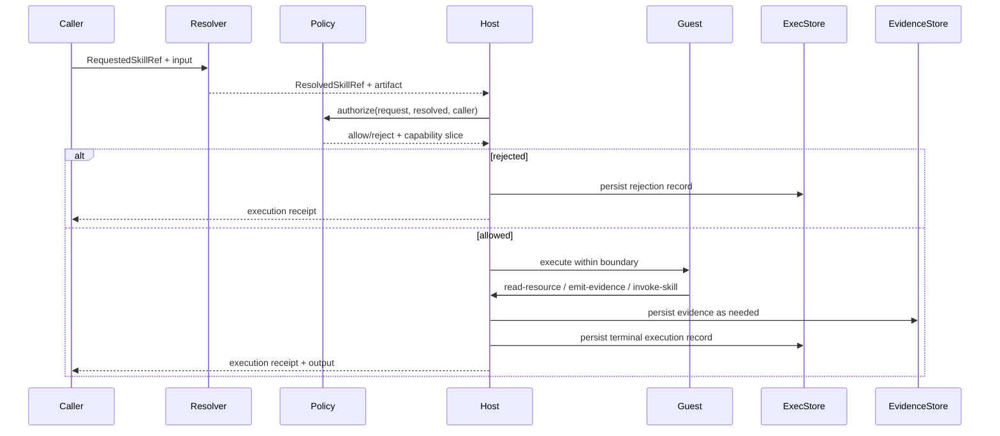

# Guild Architecture

Status: Draft v0.1  
Scope: practical architecture for a local-first Guild implementation  
Audience: implementers, maintainers, reviewers, security and platform engineers

## 1. Overview

Guild is a local-first skill execution fabric.

Its architecture exists to preserve five properties end to end:

- requested identity is separate from executable identity
- guest execution is bounded by host authority
- execution attempts become durable records
- evidence becomes a durable reusable artifact
- later inspection and explanation are grounded in those durable artifacts

The architecture is intentionally boring in the good way. You want predictable state transitions, explicit boundaries, and forensic visibility, not clever agent sludge.

The key layering rule is now explicit:

- `wit/guild-skill-v1.wit` is the canonical guest-wire boundary
- Rust host types are the richer durable platform model
- translation between those layers is explicit and host-owned
- MCP transport authorization remains separate from Guild runtime capability grants

## 2. High-Level Component Model

A practical Guild implementation contains the following subsystems:

1. Registry / Resolver
2. Installer / Bundle Manager
3. Runtime Host
4. Execution Store
5. Evidence Store
6. Resource Backend
7. Policy Engine
8. Inspect / Explain Skill Layer
9. MCP Server Facade

### 2.1 Registry / Resolver

Responsible for mapping `RequestedSkillRef` values to `ResolvedSkillRef` values and locating executable artifacts.

### 2.2 Installer / Bundle Manager

Responsible for installation, import, export, integrity verification, and local artifact indexing.

### 2.3 Runtime Host

Responsible for execution orchestration, capability enforcement, host-issued IDs, policy decisions, and runtime boundary mediation.

### 2.4 Execution Store

Responsible for durable persistence of `ExecutionRecord` objects.

### 2.5 Evidence Store

Responsible for durable persistence of evidence payloads plus evidence metadata and references.

### 2.6 Resource Backend

Responsible for host-mediated reads of persisted or external resources, ideally using the same backend semantics for host and guest access.

### 2.7 Policy Engine

Responsible for authorization decisions against skill refs, executable identities, capability families, and resource access.

### 2.8 Inspect / Explain Skill Layer

Responsible for reading durable execution and evidence artifacts and producing grounded summaries or explanations.

### 2.9 MCP Server Facade

Responsible for exposing a small honest MCP surface over the existing Guild runtime and resource backend without duplicating execution logic.

### 2.10 Current repository mapping

The current repository maps this architecture onto a small Rust workspace:

- `crates/guild-types`: shared contract types for identities, capabilities, execution, and evidence
- `crates/guild-manifest`: manifest model for source and installed skill metadata
- `crates/guild-registry`: local installer, local registry, bundle export and import, and Guild resource persistence
- `crates/guild-runner`: execution orchestration, capability evaluation, and runtime adapter boundary
- `crates/guild-mcp`: MCP-facing facade, stdio MCP server, and proof examples
- `crates/guild-sdk-rust`: guest authoring support for Rust skills
- `wit/guild-skill-v1.wit`: guest and host ABI contract
- `examples/skills/`: runnable source skills used to prove the vertical slice

## 3. Logical Data Model

Guild has four core object classes:

### 3.1 Skill artifact metadata

Describes an installed executable artifact, including its resolved identity and compatibility metadata.

### 3.2 ExecutionRecord

Describes one execution attempt and its outcome.

### 3.3 Evidence object

Stores durable evidence content plus provenance metadata.

### 3.4 Linkage metadata

Stores relationships such as:

- requested ref -> resolved ref
- parent execution -> child execution
- execution -> evidence read
- execution -> evidence produced

The important thing is not the exact schema on day one. The important thing is that these are real objects and not dead strings scattered through logs like confetti after a bad conference keynote.

In the current repository this logical model is now split more explicitly into:

- `CallerRequest` for caller intent and requested identity
- `ResolvedExecutionEnvelope` for host-issued resolved execution input
- `ExecutionRecord` and `ExecutionReceipt` for durable execution truth
- `EvidenceBlobRecord` for content-addressed payload storage
- `EvidenceRecord` plus `EvidenceRef` for host-owned per-emission metadata and guest-visible handles
- distinct manifest schema, skill API, and guest ABI version axes

## 4. Reference Execution Flow

### 4.1 Step 1: Request ingress

Caller submits:

- requested skill ref
- input payload
- caller identity or execution context
- optional request or correlation ID

The system has not yet selected what will run.

### 4.2 Step 2: Resolution

Registry resolves the requested ref to:

- concrete resolved skill ref
- executable artifact location
- compatibility and constraint metadata

This is the point where Guild becomes materially different from vague agent frameworks. A name is not enough. The system must know the exact thing it is about to run.

### 4.3 Step 3: Authorization and capability computation

Policy engine evaluates whether the request is allowed and computes the capability slice granted to the guest.

Possible outcomes:

- allowed
- allowed with narrowed capabilities
- rejected

If rejected, the runtime host still persists an `ExecutionRecord` with rejection outcome.

### 4.4 Step 4: Host-issued execution envelope

Runtime host creates:

- host-minted execution identifier
- execution context
- granted capability slice
- parent execution linkage if applicable
- host-stamped start time

The guest does not mint any of this.

### 4.5 Step 5: Guest execution

Runtime host executes the skill within the runtime boundary.

The guest may:

- read resources through host-mediated calls
- write evidence through host-mediated calls
- invoke child skills through host-mediated calls
- return structured outputs or failure signals

### 4.6 Step 6: Persistence

Runtime host persists:

- terminal execution record
- evidence blobs produced or referenced
- evidence records linking each emission to the underlying blob
- child execution linkage if present

### 4.7 Step 7: Later inspection

Inspect and explain skills query the durable stores and produce grounded explanations of what happened.

## 5. Trust Boundary

### 5.1 Host responsibilities

The host is the authority for:

- resolution
- policy
- capability enforcement
- execution IDs
- evidence record IDs
- durable persistence
- audit metadata

### 5.2 Guest responsibilities

The guest is responsible for:

- executing skill logic
- requesting permitted operations
- returning outputs or errors

### 5.3 Hard boundary rule

Guests do not get to decide what they are, what they are allowed to do, or what durable identifiers count as authoritative.

That line matters. Once the guest can self-assert authority, the whole model starts smelling like a haunted house built from JSON.

## 6. Runtime Design

### 6.1 Wasm/WASI as reference runtime

Wasm/WASI is the preferred execution substrate because it gives Guild:

- sandboxing
- portable artifacts
- host-mediated capability exposure
- reduced ambient authority
- a clean guest/host separation

### 6.2 Runtime host interface

The runtime host SHOULD expose a narrow interface to the guest for operations such as:

- `http-request`
- `read-resource`
- `emit-evidence`
- `invoke-skill`
- `log-write`

The exact ABI can evolve, but the shape should stay minimal and explicit.

### 6.3 Boundary discipline

Anything that changes durable system state or reaches outside the guest boundary SHOULD go through host APIs.

### 6.4 Current repository runtime

The current repository uses a Wasmtime-backed Wasm component adapter for the working slice. Primitive, explain, composite, and bounded HTTP example skills execute through `wit/guild-skill-v1.wit`, where the current host-facing operation names are `http-request`, `read-resource`, `emit-evidence`, `invoke-dependency`, and `log`, and skill output or failure is returned from `skill.run` rather than emitted through separate host calls.

The active Wasm inspect slice is intentionally smaller than the broader shared type surface. The currently supported capability families are `http-request`, `read-resource`, `invoke-skill`, `emit-evidence`, and `log-write`. Capabilities outside that set are rejected before execution so the runtime surface stays honest.

`http-request` is implemented as a thin Guild host adapter over `wasmtime-wasi-http`. The guest ABI remains Guild-shaped for this milestone, while the host path uses Wasmtime's real outbound HTTP support underneath. The host parses the absolute URL, enforces typed method/scheme/host/port/path constraints before dispatch, clamps timeout and response-size bounds, and persists host-owned denials or bounded failures without widening the MCP public surface.

The current example skills now include single-record and execution-tree explanation over stored Guild resources plus one bounded execution-query summary skill. Those examples deepen inspect usefulness by consuming persisted execution lineage, bounded evidence metadata, and bounded query results through the existing host-mediated resource path rather than by widening the runtime surface.

The current MCP layer is intentionally smaller still: a stdio server, one public tool (`guild.inspect`), bounded recent execution resource listing, Guild resource reads, and Guild URI resource templates for direct artifacts and bounded execution-query views.

## 7. Registry and Resolution Architecture

### 7.1 Requested refs

Human-meaningful references may be aliases, names, channels, or semantic identifiers.

### 7.2 Resolved refs

Resolved refs identify exact artifacts and SHOULD be digest-addressed.

### 7.3 Registry duties

The registry / resolver is responsible for:

- requested ref lookup
- alias/channel handling
- compatibility selection
- resolved identity issuance
- artifact lookup

### 7.4 Why this split exists

Without this split, you cannot reliably answer the question:

what exact thing ran?

And if you cannot answer that, you are not building infrastructure. You are building folklore.

## 8. Artifact Lifecycle Architecture

### 8.1 Install path

Install takes a source artifact and produces:

- a verified local artifact record
- resolved identity metadata
- executable placement within the Guild root

The current local installer stages source installs into temporary directories, validates the staged result, and atomically moves the digest directory into place. It does not pre-delete the entire version subtree, and install failure does not remove previously working installed digests.

### 8.2 Export path

Export produces a portable bundle including:

- executable payload
- resolved identity metadata
- bundled file digests
- in the current local signed flow, a detached signature envelope

The current repository supports two local packaging shapes for that same installed-state payload:

- a native signed installed-bundle directory
- an OCI image layout whose root manifest points at the same signed bundle index plus the bundled installed files as OCI blobs

The current repository also supports OCI registry transport for that same OCI-mapped artifact. Registry publication moves installed executable state, not source trees.

### 8.3 Import path

Import validates the bundle, verifies signature, trust, and bundled file integrity, and installs it into the local Guild root.

When the OCI image layout mapping is used, the importer first validates OCI layout structure plus descriptor digests and sizes, then reconstructs the same signed installed-bundle payload and runs the existing trust/signature/import verification flow before installation.

When OCI registry transport is used, the pull path first retrieves the OCI image index, root manifest, and referenced blobs from the registry, validates their structure and digests, then reconstructs the same signed installed-bundle payload and runs the existing trust/signature/import verification flow before installation.

### 8.4 Root portability

Two different Guild roots should be able to agree on artifact identity for the same bundle, even if their local storage layout differs.

### 8.5 Current repository portability flow

The working portability flow is built from installed executable state rather than source directories. The native signed-bundle directory remains the canonical signed transport unit. OCI image layout is an additional local transport mapping over that same signed payload, and OCI registry transport moves that same OCI-mapped artifact between Guild roots. Every import path verifies trust, signature, and bundled file digests before installation and writes host-owned verification metadata alongside imported installed records.

## 9. Execution Store Design

### 9.1 Required records

Execution store must persist all of:

- successful executions
- failed executions
- rejected executions

### 9.2 Why rejections matter

Rejections are not noise. They are part of the system truth.

If a skill was denied by policy, that matters just as much as a crash, especially in security-sensitive systems.

### 9.3 Parent-child graph

Execution store should support traversal across:

- parent -> child
- child -> parent
- execution -> evidence
- evidence -> execution

### 9.4 Suggested storage shape

Implementation is flexible, but the model should support:

- durable IDs
- timestamps
- outcome classes
- lineage edges
- audit metadata
- structured search/filtering

The current file-backed execution store is create-only for execution records. Duplicate durable execution IDs are rejected instead of silently overwriting prior records.

## 10. Evidence Store Design

### 10.1 Evidence as durable object

Evidence store is not just a cache. It is a durable artifact store.

### 10.2 Evidence contents

Evidence may contain:

- raw resource material
- derived summaries
- structured extraction results
- normalized observations
- explanation-ready snapshots

### 10.3 Evidence references

Evidence store issues host-owned references that can later be reused by inspect/explain skills.

### 10.4 Provenance

Evidence metadata should capture at least:

- producing execution
- read source if applicable
- creation time
- type/format
- integrity metadata if relevant

The current repository separates evidence blob identity from evidence-record identity:

- payload blobs are stored content-addressed under digest URIs
- each evidence emission gets a host-minted evidence-record URI
- evidence records link the emission to the blob digest plus `produced_by_execution` metadata

## 11. Resource Backend Architecture

### 11.1 Shared semantics

Host reads and guest `read-resource` calls should hit the same conceptual backend.

The current repository also treats authorization scopes canonically: `read-resource` grants are expressed as exact local Guild scope roots and matched against parsed execution, blob, evidence-record, and execution-query URIs rather than ad hoc raw string-prefix checks.

### 11.2 Why this matters

If host-side inspection sees one world and guest-side execution sees another, explanations become fake fast.

### 11.3 Backend responsibilities

Resource backend should provide:

- stable references
- controlled access
- explicit attribution
- optional caching/normalization
- policy-aware reads

The current repository now adds one bounded local query layer on top of that same backend. Execution-query resources are still host-issued Guild URIs, not a general search API. They are evaluated locally against persisted execution records, ordered deterministically by finished and started timestamps plus execution ID, capped by explicit limits, and exposed through the same registry-backed `read_resource` path used by MCP `resources/read` and guest `read-resource`.

## 12. Composite Skill Architecture

### 12.1 Composite control flow

Composite skills coordinate child skill invocations through the runtime host.

### 12.2 Host-mediated child calls

Child calls should not bypass the runtime host. The host must still:

- resolve child requested refs
- apply policy
- compute capability slices
- issue host-minted child execution IDs
- persist child outcomes

### 12.3 Composite success semantics

A composite skill may complete successfully even if a child fails or is rejected, provided its own logic handles that outcome.

### 12.4 Inspection goal

After the fact, the system must still make it easy to answer:

- which child skills ran?
- in what relation?
- under which resolved identities?
- which failed?
- which were rejected?
- which evidence objects were involved?

## 13. Inspect / Explain Architecture

### 13.1 Explain from artifacts

Explain skills are consumers of durable system truth.

### 13.2 Input sources

An explain skill may read:

- execution records
- evidence objects
- resource references
- policy results where permitted

### 13.3 Failure handling

Explain skills should operate over failed and rejected runs, not only clean successes.

### 13.4 Why this is a core feature

This is not bolt-on observability. It is the whole point. If the system cannot later explain what happened from durable artifacts, it falls back into prompt-era fog.

## 14. Policy Engine Architecture

### 14.1 Decision points

Policy should be enforced at:

- initial execution request
- resource read
- evidence write
- child invocation
- inspect/explain access

### 14.2 Policy inputs

A policy decision may consider:

- caller identity or caller class
- tenant identity
- requested skill ref
- resolved skill ref
- artifact digest
- caller-requested capabilities
- skill-declared required capabilities
- capability family
- resource identity
- evidence identity
- installed verification metadata
- environment or root configuration

### 14.3 Durable denials

Rejected operations should be durable enough to support later audit.

### 14.4 Current repository policy shape

The current repository now uses a small local-first policy layer instead of treating caller intent as the final grant:

- `guild.inspect` still accepts caller-requested capabilities
- the host loads an optional `policy.json` from the Guild root or falls back to a built-in default profile
- the host derives a local trust tier from installed verification state plus the local trusted publisher record
- the host selects a named policy profile by actor and/or tenant before applying capability rules
- the runner evaluates policy before execution and produces a host-owned `PolicyDecision`
- policy outcomes are `allowed`, `reduced`, or `rejected`
- reductions and denials carry host-owned reason codes and survive into durable execution records
- child execution starts from the parent-derived subset and is then re-evaluated by the same host policy path, so policy can narrow but never widen authority

The default local profile keeps current example flows working by allowing only caller-requested grants that fit the declared capability surface of the resolved local dependency tree. Named profiles then reduce or deny from that starting point using typed capability ceilings plus host-owned trust metadata. In the current repository, `http-request` is the primary higher-risk family used to prove trust-tier-aware reductions and denials.

## 15. Example Logical Layout of a Guild Root

```text
<guild-root>/
  installed/
    <namespace>/<name>/<version>/<digest-dir>/
      manifest.json
      component.wasm
      ...
      verification.json   # imported installs only
  executions/
    <execution-id>.json
  objects/
    sha256/
      <digest-hex>/
        payload
        blob.json
    records/
      <evidence-record-id>.json
  trust/
    publishers/
      <publisher-id>.json
  .source-install-staging/
  .bundle-import-staging/
  .oci-layout-import-staging/
```

This is illustrative, not normative. The current local registry root keeps installed executable state, execution records, evidence storage, and trusted publisher records under one root. Native signed-bundle directories and OCI image layout directories are caller-chosen export/import locations outside that root in the current milestone, while OCI registry transport stores that same signed installed-state payload in a separate OCI registry under a caller-chosen repository reference.

## 16. Sequence Sketch



## 17. Deployment Shape

### 17.1 Local-first default

Guild should work as a local process or local service boundary without requiring a central hosted control plane.

### 17.2 Future decomposition

The architecture can later split across processes or services, but only if the core trust boundaries remain intact.

### 17.3 Good decomposition rule

Split implementation boundaries where they improve integrity, portability, or inspectability. Do not split them just to cosplay distributed systems.

## 18. Operational Benefits

This architecture buys you the things most agent stacks keep hand-waving about:

- reproducibility through immutable execution identity
- security through explicit capability mediation
- auditability through durable execution and evidence records
- composability without losing lineage
- explainability grounded in artifacts
- portability across local roots

That is why the architecture exists. Not because more components are fun. No one needs more components. People can barely survive the ones they already invented.

## 19. Current Repository Baseline

The current repository implements a real but intentionally narrow slice of this architecture:

- source skills install into local digest-pinned installed records
- source installs stage and validate before an atomic move into installed state
- the local registry resolves only against installed executable state
- requested resolution fails closed on same-version multi-digest ambiguity
- the runtime host executes Wasm components through Wasmtime
- caller-requested grants flow through a host-owned local policy evaluator before typed capability enforcement
- successful, failed, and rejected resolved executions persist as durable execution records with host-minted IDs and host-stamped timestamps
- evidence persists as durable local objects with separate blob and evidence-record identity and is readable through the same backend used by guest `read-resource`
- bounded execution-query resources and templates derive from that same persisted execution store and are readable through the same backend by guests and MCP clients
- composite skills invoke declared child dependencies by alias through the same host boundary
- resource-aware inspect skills can explain stored execution trees by walking persisted child lineage and bounded evidence descriptors through existing Guild execution and object-record URIs, and can summarize bounded execution-query resources without learning a second backend
- supported capability families in the active inspect slice are `http-request`, `read-resource`, `invoke-skill`, `emit-evidence`, and `log-write`; unsupported families are rejected before execution
- `guild.inspect` in `guild-mcp` rides that same registry, runner, and storage path
- `guild-mcp-server` exposes that same path over stdio MCP with one public tool plus Guild execution, evidence, and bounded execution-query resources

What is still deferred in this repo:

- remote or distributed policy evaluation
- a broader policy language beyond the current local typed profile
- subscriptions, list-changed notifications, full-text search, and broader evidence-specific query resources
- full `plan` execution
- `apply` mode
- broader remote publication, trust, and discovery infrastructure

## 20. Near-Term Build Priorities

Phase 1

- install/resolve/execute on immutable artifacts
- Wasm/WASI runtime boundary
- durable execution store
- durable evidence store
- primitive and composite execution support

Phase 2

- inspect/explain skills over persisted artifacts
- bounded artifact query resources over persisted execution records
- failure/rejection views
- resource backend unification

Phase 3

- signatures and provenance
- richer local policy profiles
- ecosystem distribution and trust tiers
- retention/governance controls

## 21. Bottom Line

Guild architecture is about making AI skill execution behave like a real system.

That means exact identity, bounded runtime authority, durable records, durable evidence, and later explanation that does not depend on remembering what the model "probably did."
