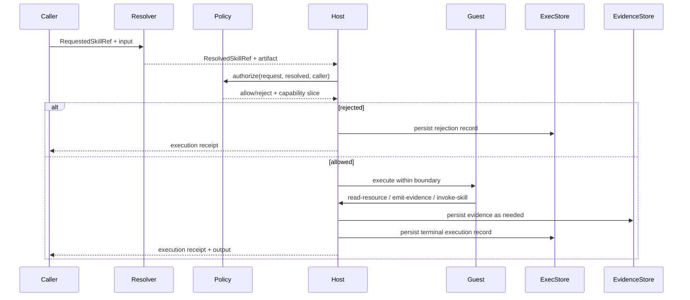

# Guild Architecture

Status: Draft v0.1  
Scope: practical architecture for a local-first Guild implementation  
Audience: implementers, maintainers, reviewers, security and platform engineers

This document is explanatory architecture, not the primary runtime-contract source of truth. For normative runtime ownership, use `SPECS.md` section "Source Of Truth", `wit/guild-skill-v1.wit`, and the core Rust runtime/types.
For the frozen core runtime-contract surfaces in this milestone, see `SPECS.md` section "Contract Surface v1 (core)".
For the current long-term direction, see
[`docs/strategy/session-substrate/00-umbrella-epic.md`](docs/strategy/session-substrate/00-umbrella-epic.md)
and ADR `0020`. For the bridge from the prior framing to the new one, see
[`docs/project-positioning.md`](docs/project-positioning.md). For the current
shipped skill-first operator surface, see
[`docs/how-guild-works.md`](docs/how-guild-works.md).
That surface is explanatory; the architecture below still describes how Guild
executes skills today.

Read this document as the practical map for how Guild delivers admission,
isolation, receipts, evidence, and replay-oriented explanation on today's live
path. It explains how the subsystems fit together; it does not widen the live
runtime or proof-backed surface by prose alone.

## 1. Overview

Guild's architecture exists to support portable, capability-bounded skill
artifacts and the host-owned trust chain around how they are admitted,
executed, evidenced, and later explained.

The current live path already makes execution and evidence durable. The bounded
draft-v1 admission layer stays separate and explicit; this architecture doc
does not turn it into a new live runtime contract by prose alone.

Its architecture exists to preserve five properties end to end:

- requested identity is separate from executable identity
- guest execution is bounded by host authority
- execution attempts become durable records and receipts
- evidence becomes a durable reusable artifact
- later inspection, explanation, and reference applications are grounded in those durable artifacts

The architecture is intentionally boring in the good way. You want predictable state transitions, explicit boundaries, and forensic visibility, not clever agent sludge.

The key layering rule is now explicit:

- `wit/guild-skill-v1.wit` is the canonical guest-wire boundary package
- `guild-skill-inspect-v1` is the active inspect ABI world inside that package
- Rust host types are the richer durable platform model
- translation between those layers is explicit and host-owned
- the active inspect projection boundary is centralized in the runner
- MCP transport authorization remains separate from Guild runtime capability grants

The session-substrate direction adds three architecture guardrails now, even
before there is a full session runtime:

- `Harness` is first-class architecture vocabulary, but it remains docs-first
  until one stable package boundary exists across manifest, registry, runner,
  and transport identity
- canonical durable session identity is host-minted and host-owned above any
  concrete runtime materialization
- wake-time reuse is a separate host decision from invoke-time admission,
  especially for secrets, mounts, network policy, and runtime placement

The lifecycle guardrail is equally important:

- `pending-admission` and `admitted` are transient attempt states, not durable
  rest states
- `suspended` means a direct resume path is still eligible if wake-time checks
  pass
- `rehydration-required` means direct resume is already invalid and the broker
  must rehydrate or cold-start after a fresh admitted attempt
- a denied wake returns an existing session to its prior durable state rather
  than stranding it in a transient state
- `failed` stops automatic wake logic, while `terminated` is terminal

The persistence guardrail is now equally explicit:

- host-owned durable session truth is the canonical continuity contract
- rebuildable harness state is replaceable implementation detail even when it
  is serialized for faster wake paths
- snapshots, live connections, and runtime-local caches are rebuild aids, not
  authoritative session identity or continuity truth
- cold-start is a safe fallback only when the promised session continuity can
  still be satisfied from durable host truth plus immutable artifacts

## 2. High-Level Component Model

A practical Guild implementation contains the following subsystems:

1. Registry / Resolver
2. Installer / Bundle Manager
3. Runtime Host
4. Execution Store
5. Evidence Store
6. Resource Backend
7. Policy Engine
8. Inspect / Explain Skill Layer
9. MCP Server Facade

### 2.1 Registry / Resolver

Responsible for mapping `RequestedSkillRef` values to `ResolvedSkillRef` values and locating executable artifacts.

### 2.2 Installer / Bundle Manager

Responsible for installation, import, export, integrity verification, and local artifact indexing.

### 2.3 Runtime Host

Responsible for execution orchestration, capability enforcement, host-issued IDs, policy decisions, and runtime boundary mediation.

### 2.4 Execution Store

Responsible for durable persistence of `ExecutionRecord` objects.

### 2.5 Evidence Store

Responsible for durable persistence of evidence payloads plus evidence metadata and references.

### 2.6 Resource Backend

Responsible for host-mediated reads of persisted or external resources, ideally using the same backend semantics for host and guest access.

### 2.7 Policy Engine

Responsible for authorization decisions against skill refs, executable identities, capability families, and resource access.

### 2.8 Inspect / Explain Skill Layer

Responsible for reading durable execution and evidence artifacts and producing grounded summaries or explanations.

### 2.9 MCP Server Facade

Responsible for exposing a small honest MCP surface over the existing Guild runtime and resource backend without duplicating execution logic.

### 2.10 Local Operator Shell

Responsible for exposing the same registry, runtime, trust, and resource behavior through one thin local CLI without introducing a second state model.

The current operator shell rules are:

- `guild` is the canonical installed local operator binary
- operator-facing root selection resolves as `--registry-root <path>`, then `GUILD_REGISTRY_ROOT`, then `~/.guild`
- there is no cwd-local `.guild/` default
- `guild init` is the persistent local setup path for creating the selected root and printing or writing Codex stdio configuration
- `guild codex` remains a deterministic repo-local scenario and smoke helper surface rather than the normal persistent setup path

### 2.11 Current repository mapping

The current repository maps this architecture onto a small Rust workspace:

- `crates/guild-types`: shared contract types for identities, capabilities, execution, and evidence
- `crates/guild-manifest`: manifest model for source and installed skill metadata
- `crates/guild-registry`: local installer, local registry, bundle export and import, and Guild resource persistence
- `crates/guild-runner`: execution orchestration, capability evaluation, and runtime adapter boundary
- `crates/guild-mcp`: thin `guild` CLI, MCP-facing facade, stdio MCP server, and proof examples
- `crates/guild-sdk-rust`: guest authoring support for Rust skills
- `wit/guild-skill-v1.wit`: guest and host ABI contract package, including the active inspect world
- `examples/skills/`: runnable source skills used to prove the vertical slice
- repo-owned Cargo package versions and Guild skill manifest versions are distinct axes; Guild resolution and transport identity follow manifest metadata plus resolved artifact identity rather than build-package metadata

## 3. Logical Data Model

Guild has four core object classes:

### 3.1 Skill artifact metadata

Describes an installed executable artifact, including its resolved identity and compatibility metadata.

### 3.2 ExecutionRecord

Describes one execution attempt and its outcome.

### 3.3 Evidence object

Stores durable evidence content plus provenance metadata.

### 3.4 Linkage metadata

Stores relationships such as:

- requested ref -> resolved ref
- parent execution -> child execution
- execution -> evidence read
- execution -> evidence produced

The important thing is not the exact schema on day one. The important thing is that these are real objects and not dead strings scattered through logs like confetti after a bad conference keynote.

In the current repository this logical model is now split more explicitly into:

- `CallerRequest` for caller intent and requested identity
- `ResolvedExecutionEnvelope` for host-issued resolved execution input
- `ExecutionRecord` and `ExecutionReceipt` for durable execution truth
- `EvidenceBlobRecord` for content-addressed payload storage
- `EvidenceRecord` plus `EvidenceRef` for host-owned per-emission metadata and guest-visible handles
- distinct manifest schema, skill API, and guest ABI version axes
- implementation-language package metadata such as Cargo package version is build and distribution metadata for a crate, not Guild execution identity

### 3.5 Session durability boundary

The future session broker should preserve one explicit line between canonical
durable session truth and rebuildable harness state.

Canonical durable session truth should include:

- host-minted `SessionId` and the current durable lifecycle state
- admission-relevant caller intent, correlation data, and policy input
- granted capability envelope or enough durable policy state to recompute it
  safely
- references to required artifacts, runtime class, and harness identity mapping
- receipt lineage, evidence refs, and host-owned audit metadata
- any service reconnect descriptors or rebinding requirements the host expects
  to satisfy on wake

Rebuildable harness state should include:

- sandbox, process, container, VM, and placement-local identity
- in-memory heap, temp directories, caches, and open file descriptors
- live sockets, active external-service sessions, leases, and opaque runtime
  handles
- snapshots or serialized runtime state that only accelerate one wake path

Broker behavior should follow that boundary:

- `resumed` may reuse preserved runtime-local state only after wake-time checks
  prove that reuse remains safe
- `rehydrated` must rebuild from durable host truth, durable artifacts, and any
  validated serialized state; invalid snapshots are discarded rather than
  treated as canonical continuity
- `cold` carries forward only durable host truth and immutable artifacts into a
  fresh materialization; it is the safe fallback when no trusted resume or
  rehydration path remains
- if an external service cannot be safely reconnected or re-authorized, Guild
  must rehydrate, cold-start, or fail the wake rather than pretend the prior
  connection survived

This boundary keeps receipts honest: the host can explain which continuity came
from durable truth, which parts were rebuilt, and why a wake fell back to
`cold` instead of claiming a stronger resume than the system could prove.

## 4. Reference Execution Flow

### 4.1 Step 1: Request ingress

Caller submits:

- requested skill ref
- input payload
- caller identity or execution context
- optional request or correlation ID

The system has not yet selected what will run.

### 4.2 Step 2: Resolution

Registry resolves the requested ref to:

- concrete resolved skill ref
- executable artifact location
- compatibility and constraint metadata

This is the point where Guild becomes materially different from vague agent frameworks. A name is not enough. The system must know the exact thing it is about to run.

### 4.3 Step 3: Authorization and capability computation

Policy engine evaluates whether the request is allowed and computes the capability slice granted to the guest.

Possible outcomes:

- allowed
- allowed with narrowed capabilities
- rejected

If rejected, the runtime host still persists an `ExecutionRecord` with rejection outcome.

### 4.4 Step 4: Host-issued execution envelope

Runtime host creates:

- host-minted execution identifier
- execution context
- granted capability slice
- parent execution linkage if applicable
- host-stamped start time

The guest does not mint any of this.

### 4.5 Step 5: Guest execution

Runtime host executes the skill within the runtime boundary.

The guest may:

- read resources through host-mediated calls
- write evidence through host-mediated calls
- invoke child skills through host-mediated calls
- return structured outputs or failure signals

### 4.6 Step 6: Persistence

Runtime host persists:

- terminal execution record
- evidence blobs produced or referenced
- evidence records linking each emission to the underlying blob
- child execution linkage if present

### 4.7 Step 7: Later inspection

Inspect and explain skills query the durable stores and produce grounded explanations of what happened.

## 5. Trust Boundary

### 5.1 Host responsibilities

The host is the authority for:

- resolution
- policy
- capability enforcement
- execution IDs
- evidence record IDs
- durable persistence
- audit metadata

### 5.2 Guest responsibilities

The guest is responsible for:

- executing skill logic
- requesting permitted operations
- returning outputs or errors

### 5.3 Hard boundary rule

Guests do not get to decide what they are, what they are allowed to do, or what durable identifiers count as authoritative.

That line matters. Once the guest can self-assert authority, the whole model starts smelling like a haunted house built from JSON.

## 6. Runtime Design

### 6.1 Wasm/WASI as reference execution format

Wasm/WASI is the preferred execution format because it gives Guild:

- sandboxing
- portable artifacts
- host-mediated capability exposure
- reduced ambient authority
- a clean guest/host separation

### 6.2 Runtime host interface

The runtime host SHOULD expose only the frozen active live runtime families
listed in `SPECS.md` section "Contract Surface v1 (core)" plus any future
families that are added there in a later milestone.

The exact ABI can evolve, but the shape should stay minimal and explicit.

### 6.3 Boundary discipline

Anything that changes durable system state or reaches outside the guest boundary SHOULD go through host APIs.

### 6.4 Current repository runtime

The current repository uses a Wasmtime-backed Wasm component adapter for the working slice. Primitive, explain, composite, and bounded HTTP example skills execute through the dedicated inspect world `guild-skill-inspect-v1` defined in `wit/guild-skill-v1.wit`, where the active host-facing operation names are `http-request`, `read-resource`, `emit-evidence`, `invoke-dependency`, and `log`, and skill output or failure is returned from `inspect-skill.run` rather than emitted through separate host calls.

The active Wasm inspect slice is intentionally smaller than the broader shared
type surface. The frozen current live family registry is owned by
`SPECS.md` section "Contract Surface v1 (core)". Capabilities outside that set
are rejected before execution, and their host imports are absent from
`guild-skill-inspect-v1`, so the active runtime surface stays honest by
construction.

The runtime now also preflights Guild component imports before instantiation. In the active inspect path, only `guild:skill/inspect-types@1.0.0` and `guild:skill/inspect-host@1.0.0` are allowed. If an artifact still exposes a broader Guild import surface, the host rejects it as `unsupported-runtime-surface` during runtime load instead of letting it collapse into a generic component-instantiation failure.

The broader shared Rust type surface now also includes an explicit typed `filesystem` family for future work. That host-side contract models named roots, guest-path prefixes, host-path concepts, and explicit read/write/create/append operations so manifests, caller intent, and local policy can describe filesystem authority intentionally. The current inspect guest ABI does not expose filesystem imports or preopened directories, and the active Wasm inspect slice rejects any manifest or granted filesystem capability before guest start.

The host-to-guest projection boundary is explicit in the runner. The host retains the richer durable `ExecutionContext`, `GrantedCapability`, request, policy, and evidence metadata model, then projects only the inspect-visible subset into `guild-skill-inspect-v1` before guest start through one centralized inspect-projection layer.

That projection is intentionally not an isomorphism:

- inspect guest `ExecutionContext` is a bounded subset and carries host-minted execution identity, trace/tenant IDs, resolved skill identity, input hash, `now_utc`, budget, and guest-visible granted capabilities only
- inspect guest `ExecutionContext` omits `mode` because the inspect world is inspect-only by contract
- current active grant projections for `http-request`, `read-resource`, `invoke-skill`, `emit-evidence`, and `log-write` are full at the current guest-visible grant-shape level
- host-owned `CallerRequest.requested_capabilities`, `PolicyDecision`, provenance, termination detail, `EvidenceRecord`, and child lineage stay outside the guest ABI and remain canonical in durable records
- explain/debug flows that need the full truth read `ExecutionRecord`, `EvidenceRecord`, and Guild resources rather than guessing from guest-visible context

`http-request` is implemented as a thin Guild host adapter over `wasmtime-wasi-http`. The guest ABI remains Guild-shaped for this milestone, while the host path uses Wasmtime's real outbound HTTP support underneath. The host parses the absolute URL, enforces typed method/scheme/host/domain-suffix/port/path constraints before dispatch, classifies and blocks loopback, link-local, private-network, and raw IP-literal targets unless explicitly granted, and keeps redirects disabled unless the grant explicitly enables bounded following. Every redirected hop is re-authorized against the same granted HTTP slice and execution budget before dispatch, and the runtime persists host-owned denials or bounded failures without widening the MCP public surface.

The current example skills now include single-record and execution-tree explanation over stored Guild resources plus one bounded execution-query summary skill. Those examples deepen inspect usefulness by consuming persisted execution lineage, bounded evidence metadata, and bounded query results through the existing host-mediated resource path rather than by widening the runtime surface.

The draft M3/M4 schema bundle under `docs/schemas/draft-v1/` is still draft vocabulary layered on top of this runtime, not a replacement for this runtime description. The current repository truth is the host-owned capability-family and inspect-world model described here.

The live Rust vocabulary now wins explicitly:

- `runtime_guarantee.supported_canonical_families` is the authoritative live-runtime family list for the draft bundle
- `supported_effect_classes` remains a temporary draft-v1 compatibility list for legacy bounded examples
- the frozen current active canonical family list now lives in `SPECS.md` section "Contract Surface v1 (core)"
- `docs/schemas/draft-v1/family_support_matrix.json` is the machine-readable per-family or per-layer status source for the draft control-plane surface

M8c closes the biggest remaining lie-shaped gap in that draft bundle: live proof now exists only where the runtime actually supports it.

- `read-resource` now has bounded live proof over immutable execution/object-record scope roots and one honest end-to-end chain from plan to proof to token to witness
- `log-write` now has real live family proof over the observed discrete level slice
- `http-request` now has bounded live proof only for eight deterministic replay-fixtured slices over `http`: loopback IP `GET` and `HEAD`, each with an explicit-port form and an implicit-default-port form, plus exact `localhost` `GET` and `HEAD`, each with an explicit-port form and an implicit-default-port form, always with deterministic loopback-only resolution bindings for the hostname slices and all with no query and no redirects
- `invoke-skill` now has two bounded live-proof-backed slices only: one exercised declared alias resolved through the installed dependency snapshot to one exact zero-authority child on `guild-skill-inspect-v1`, and one exact two-child same-alias zero-authority inspect fan-out in deterministic order under that same boundary
- other hostname forms, query or fragment components, redirects, multiple exercised requests outside the checked `http-request` slice set, `https`, broader `invoke-skill` shapes including dynamic or broader resolution, broader multi-child fan-out, recursion, child-side authority use, and non-inspect child targets, plus broader or legacy `emit-evidence` flows beyond the exact single-emission fixed local-object-store slice, still stay explicitly `not_proven` for live proof and therefore stay on upper-bound-only or unlinked downstream behavior. For `emit-evidence`, the runtime now proves one exact single-emission fixed local-object-store slice and carries the exact sink and payload facts as a host-owned binding through proof, token, and witness linkage instead of widening the guest-visible grant shape.

M8-proper now adds a measured slice-aware benchmark on top of that shape. The machine-readable artifact is `docs/schemas/draft-v1/benchmark_matrix.json` and the paired report is `docs/benchmarking/m8-real-path-benchmark.md`. Those artifacts currently measure:

- supported proof-linked slices only for `read-resource`, the eight bounded `http-request` replay slices, the two bounded `invoke-skill` zero-authority inspect slices, and one exact single-emission `emit-evidence` fixed-sink slice
- one proof-only `log-write` slice through M4 plus M5 only, with no claimed checked real-path M6 or M7 linkage
- unsupported redirect `http-request` and replay-unavailable `emit-evidence` slices as explicit refusal or fallback cases, not hidden failure noise
- extra fail-closed walls for `http-request` no-replay, `read-resource` execution-query shrink, and `invoke-skill` child-authority use
- measured overhead distributions in the checked `benchmark_matrix.json` and paired report, generated through the Rust-native benchmark tooling rather than a separate Python truth path
- coverage-limited negative-claim outcomes across the checked non-`log-write` slices rather than synthetic success counts

That draft mapping is intentionally explicit:

| `docs/schemas/draft-v1/` term | Current runtime term | Relationship |
|---|---|---|
| `component.wit_world` | `guild-skill-inspect-v1` runtime-entrypoint / world checks | bundled contracts now target the live inspect world explicitly |
| direct canonical `http-request` | `http-request` | direct canonical support in the draft M4, M6, and M7 layers |
| direct canonical `read-resource` | `read-resource` | direct canonical support in the draft M4, M6, and M7 layers |
| direct canonical `invoke-skill` | `invoke-skill` | direct canonical support in the draft M4, M6, and M7 layers at the current alias-only runtime scope |
| direct canonical `emit-evidence` | `emit-evidence` | direct canonical support in the draft M4, M6, and M7 layers |
| direct canonical `log-write` | `log-write` | direct canonical support in the draft M4, M6, and M7 layers at the current level-only runtime scope |
| `component.invoke` | `invoke-skill` | deprecated narrowing compatibility mapping |
| `net.connect` | `http-request` | deprecated narrowing compatibility mapping; only explicit HTTP(S) GET or HEAD scopes map safely |
| `net.resolve` | `http-request` | unsupported; the live runtime does not expose a standalone DNS-resolution family |
| `fs.*` effect classes | `filesystem` family | partial; active inspect still rejects filesystem before guest start |
| `secret.read` | `get-secret` | partial; no live inspect enforcement or observation path yet |
| `clock.read` | `wall-clock` | partial; draft term is less precise than the runtime family split |

This is why the schema bundle remains marked draft: component portability and effect vocabulary portability are not the same thing as enforcement portability of the current runtime slice.

That draft bundle now also contains a real M4 admission layer for its own vocabulary:

- the Rust-native compatibility flow under `xtask` and `crates/guild-draft-truth` is the hard-requirement precheck layer only
- `admission_engine.py` consumes one contract, one admission request, and one or more runtime guarantees
- `execution_plan` is the resulting safe upper-bound invocation plan

That M4 layer does not do M5 minimization, does not claim that compatibility precheck alone is admission, and still emits unsigned plans by default. The repository now has a real verifiable sign/verify path for those plans through the existing publisher identity and trusted-publisher model, but signing is an explicit later step rather than part of admission derivation itself.

The same draft bundle now also contains one bounded M5 layer for its own vocabulary:

- `minimization_engine.py` consumes one admissible `execution_plan`, one explicit invocation fixture, one runtime guarantee, and one deterministic `comparator_profile`
- `proof_record` is the resulting minimization artifact
- exact discrete elimination is only exact over the finite grant subsets the engine actually explores
- scope shrinkers are bounded observed-effect projections and therefore report `bounded_minimal`, not exact minimality

That M5 layer is intentionally split in M8c: the older Python harness remains draft-example-only, while the real live Rust proof path is now consumed only for the families it can honestly support today. The repository still does not have a runtime-general proof layer across every canonical family.

That draft bundle now also contains one draft-local M6 token layer for its own vocabulary:

- `token_engine.py` issues and verifies invocation-bound delegated capability tokens from an admissible M4 plan and an optional M5 proof
- `delegated_capability_token.schema.json` describes both root and child token claims
- `token_verification_result.schema.json` describes the fail-closed verifier output
- root issuance defaults to proof-backed issuance and refuses by default when no acceptable proof exists unless the caller explicitly enables upper-bound issuance
- child issuance is explicit, non-pass-through by default, and stays bounded by both the parent token and the applicable M4 or M5 authority envelope

That M6 layer is also intentionally narrower than the eventual runtime story:

- it uses a draft-local shared-secret HMAC MAC over canonical JSON claims rather than a public verifiable signature or attestation mechanism
- replay detection and revocation hooks are local verifier-state features for the bundled harness, not a distributed control-plane
- runtime binding is only as strong as the draft bundle's runtime-guarantee identity and vocabulary alignment
- it is not the later M7 witness layer and does not by itself prove exercised authority

So the draft M6 path is useful for tightening control-plane semantics, but it still does not justify runtime-general enforcement claims for the live Rust runtime.

That draft bundle now also contains one bounded M7 witness layer for its own vocabulary:

- `witness_engine.py` generates `witness_record` artifacts from an admissible M4 plan, an optional M5 proof, an optional verified M6 token basis, and one bounded observation source
- `witness_core.py` verifies witness MACs, bindings, coverage semantics, envelope comparisons, redaction hashes, and one small fixed claim vocabulary
- `witness_verification_result.schema.json` captures the explicit verifier output for both witness verification and fixed claim checks

That M7 layer is intentionally honest about what it is and what it is not:

- it records exercised authority, blocked attempted authority, and granted-but-unused authority as distinct concepts
- it treats absence claims as coverage-sensitive rather than as a default success path
- it reuses the same draft-local HMAC-SHA256 MAC over canonical JSON claims used by M6, so it is not a public attestation mechanism
- it is currently complete for the bundled draft example harnesses and explicit bounded observation fixtures, and it now also consumes the live Rust `ExecutionRecord.authority_observations` stream for the active runtime families
- the live runner now persists durable per-effect exercised and blocked observations for `http-request`, `read-resource`, `invoke-skill`, `emit-evidence`, and `log-write`
- execution-record JSON and resource surfaces now also carry `authority_observations_recorded` so legacy stored executions that predate that stream remain distinguishable from explicitly recorded empty observation lists
- draft-v1 now carries live `http-request`, `read-resource`, `invoke-skill`, `emit-evidence`, and `log-write` observations directly as canonical families
- scope-only negative claims are now supported for those five families when the relevant live observation coverage is complete
- the fixed claim vocabulary still has no per-family positive observed-fact claim types, so positive claim verification remains unsupported even though witnesses carry those facts

So the current draft M7 path is useful for bounded exercised-authority verification across the five active canonical families, but it still does not justify runtime-general witness completeness claims across the full live Rust capability surface.

The current MCP layer is intentionally smaller still: a stdio server, one public tool (`guild.inspect`), a bounded discovery-oriented `resources/list` catalog, Guild resource reads, and Guild URI resource templates for direct artifacts and bounded execution-query views.

In the current repository, MCP protocol hygiene is also explicit:

- `guild.inspect` advertises truthful client hints rather than optimistic ones: it is not read-only, not idempotent, not destructive, and open-world in the MCP hint sense because real inspect execution persists durable records and may use bounded outbound HTTP
- `tools/list`, `resources/list`, and `resources/templates/list` page through deterministic ordered slices using opaque endpoint-scoped cursors
- pagination is applied only after Guild has built the already-bounded, already-authorized result set for that endpoint, so cursors do not widen access or bypass boundedness
- `resources/list` is a bounded discovery catalog, not a general resource search surface
- `resources/list` starts with the canonical recent-executions and recent-failures query URIs, then lists recent execution resources, then recent evidence-metadata resources
- evidence payload and blob URIs remain readable and discoverable through `resources/read`, `resources/templates/list`, and inspect-result links rather than by default listing

## 7. Registry and Resolution Architecture

### 7.1 Requested refs

Human-meaningful references may be aliases, names, channels, or semantic identifiers.

### 7.2 Resolved refs

Resolved refs identify exact artifacts and SHOULD be digest-addressed.

### 7.3 Registry duties

The registry / resolver is responsible for:

- requested ref lookup
- alias/channel handling
- compatibility selection
- resolved identity issuance
- artifact lookup

### 7.4 Why this split exists

Without this split, you cannot reliably answer the question:

what exact thing ran?

And if you cannot answer that, you are not building infrastructure. You are building folklore.

## 8. Artifact Lifecycle Architecture

### 8.1 Install path

Install takes a source artifact and produces:

- a verified local artifact record
- resolved identity metadata
- executable placement within the Guild root

The current local installer stages source installs into temporary directories, validates the staged result, and atomically moves the digest directory into place. It does not pre-delete the entire version subtree, and install failure does not remove previously working installed digests.

### 8.2 Export path

Export produces a portable bundle including:

- executable payload
- resolved identity metadata
- bundled file digests
- in the current local signed flow, a detached signature envelope

The current repository supports two local packaging shapes for that same installed-state payload:

- a native signed installed-bundle directory
- an OCI image layout whose root manifest points at the same signed bundle index plus the bundled installed files as OCI blobs

The current repository also supports OCI registry transport for that same OCI-mapped artifact. Registry publication moves installed executable state, not source trees.

### 8.3 Import path

Import validates the bundle, verifies signature, trust, and bundled file integrity, and installs it into the local Guild root.

When the OCI image layout mapping is used, the importer first validates OCI layout structure plus descriptor digests and sizes, then reconstructs the same signed installed-bundle payload and runs the existing trust/signature/import verification flow before installation.

When OCI registry transport is used, the pull path first retrieves the OCI image index, root manifest, and referenced blobs from the registry, validates their structure and digests, then reconstructs the same signed installed-bundle payload and runs the existing trust/signature/import verification flow before installation.

### 8.4 Root portability

Two different Guild roots should be able to agree on artifact identity for the same bundle, even if their local storage layout differs.

### 8.5 Current repository portability flow

The working portability flow is built from installed executable state rather than source directories. The native signed-bundle directory remains the canonical signed transport unit. OCI image layout is an additional local transport mapping over that same signed payload, and OCI registry transport moves that same OCI-mapped artifact between Guild roots. Every import path verifies trust, signature, and bundled file digests before installation and writes host-owned verification metadata alongside imported installed records.

## 9. Execution Store Design

### 9.1 Required records

Execution store must persist all of:

- successful executions
- failed executions
- rejected executions

### 9.2 Why rejections matter

Rejections are not noise. They are part of the system truth.

If a skill was denied by policy, that matters just as much as a crash, especially in security-sensitive systems.

### 9.3 Parent-child graph

Execution store should support traversal across:

- parent -> child
- child -> parent
- execution -> evidence
- evidence -> execution

### 9.4 Suggested storage shape

Implementation is flexible, but the model should support:

- durable IDs
- timestamps
- outcome classes
- lineage edges
- audit metadata
- structured search/filtering

The current file-backed execution store is create-only for execution records. Duplicate durable execution IDs are rejected instead of silently overwriting prior records.

## 10. Evidence Store Design

### 10.1 Evidence as durable object

Evidence store is not just a cache. It is a durable artifact store.

### 10.2 Evidence contents

Evidence may contain:

- raw resource material
- derived summaries
- structured extraction results
- normalized observations
- explanation-ready snapshots

### 10.3 Evidence references

Evidence store issues host-owned references that can later be reused by inspect/explain skills.

### 10.4 Provenance

Evidence metadata should capture at least:

- producing execution
- read source if applicable
- creation time
- type/format
- integrity metadata if relevant

The current repository separates evidence blob identity from evidence-record identity:

- payload blobs are stored content-addressed under digest URIs
- each evidence emission gets a host-minted evidence-record URI
- evidence records link the emission to the blob digest plus `produced_by_execution` metadata
- `guild://objects/records/{evidence_record_id}` remains the stable payload-dereference URI for one emitted record
- `guild://objects/records/{evidence_record_id}/metadata` exposes the host-owned `EvidenceRecord` JSON for that same emitted record

## 11. Resource Backend Architecture

### 11.1 Shared semantics

Host reads and guest `read-resource` calls should hit the same conceptual backend.

The current repository also treats authorization scopes canonically: `read-resource` grants are expressed as exact local Guild scope roots and matched against parsed execution, blob, evidence-record payload, evidence-record metadata, and execution-query URIs rather than ad hoc raw string-prefix checks.

### 11.2 Why this matters

If host-side inspection sees one world and guest-side execution sees another, explanations become fake fast.

### 11.3 Backend responsibilities

Resource backend should provide:

- stable references
- controlled access
- explicit attribution
- optional caching/normalization
- policy-aware reads

The current repository now adds one bounded local query layer on top of that same backend. Execution-query resources are still host-issued Guild URIs, not a general search API. They are evaluated locally against persisted execution records, ordered deterministically by finished and started timestamps plus execution ID, capped by explicit limits, and exposed through the same registry-backed `read_resource` path used by MCP `resources/read` and guest `read-resource`.

## 12. Composite Skill Architecture

### 12.1 Composite control flow

Composite skills coordinate child skill invocations through the runtime host.

### 12.2 Host-mediated child calls

Child calls should not bypass the runtime host. The host must still:

- resolve child requested refs
- apply policy
- compute capability slices
- issue host-minted child execution IDs
- persist child outcomes

### 12.3 Composite success semantics

A composite skill may complete successfully even if a child fails or is rejected, provided its own logic handles that outcome.

### 12.4 Inspection goal

After the fact, the system must still make it easy to answer:

- which child skills ran?
- in what relation?
- under which resolved identities?
- which failed?
- which were rejected?
- which evidence objects were involved?

## 13. Inspect / Explain Architecture

### 13.1 Explain from artifacts

Explain skills are consumers of durable system truth.

### 13.2 Input sources

An explain skill may read:

- execution records
- evidence objects
- resource references
- policy results where permitted

### 13.3 Failure handling

Explain skills should operate over failed and rejected runs, not only clean successes.

### 13.4 Why this is a core feature

This is not bolt-on observability. It is the whole point. If the system cannot later explain what happened from durable artifacts, it falls back into prompt-era fog.

## 14. Policy Engine Architecture

### 14.1 Decision points

Policy should be enforced at:

- initial execution request
- resource read
- evidence write
- child invocation
- inspect/explain access

### 14.2 Policy inputs

A policy decision may consider:

- caller identity or caller class
- tenant identity
- requested skill ref
- resolved skill ref
- artifact digest
- caller-requested capabilities
- skill-declared required capabilities
- capability family
- resource identity
- evidence identity
- installed verification metadata
- environment or root configuration

### 14.3 Durable denials

Rejected operations should be durable enough to support later audit.

### 14.4 Current repository policy shape

The current repository now uses a small local-first policy layer instead of treating caller intent as the final grant:

- `guild.inspect` still accepts caller-requested capabilities
- the host loads an optional `policy.json` from the Guild root or falls back to a built-in default profile
- the host derives a local trust tier from installed verification state plus the local trusted publisher record
- the host selects a named policy profile by actor and/or tenant before applying capability rules
- the runner evaluates policy before execution and produces a host-owned `PolicyDecision`
- policy outcomes are `allowed`, `reduced`, or `rejected`
- reductions and denials carry host-owned reason codes and survive into durable execution records
- child execution starts from the parent-derived subset and is then re-evaluated by the same host policy path, so policy can narrow but never widen authority

The default local profile keeps current example flows working by allowing only caller-requested grants that fit the declared capability surface of the resolved local dependency tree. Named profiles then reduce or deny from that starting point using typed capability ceilings plus host-owned trust metadata. In the current repository, `http-request` is the primary higher-risk family used to prove trust-tier-aware reductions and denials.
`cap` rules may split a broader same-family grant into a narrower union, while
`deny` rules conservatively remove any grant that overlaps a denied typed
ceiling rather than silently missing a broader request.

`filesystem` is now also explicit in that host-side policy vocabulary, but only as a deferred family. Profiles may reference it in typed rules, and manifests may declare it, yet the runner still fails closed before guest start if filesystem survives policy into the final granted set for the active inspect slice.

## 15. Example Logical Layout of a Guild Root

```text
<guild-root>/
  installed/
    <namespace>/<name>/<version>/<digest-dir>/
      manifest.json
      component.wasm
      ...
      verification.json   # imported installs only
  executions/
    <execution-id>.json
  objects/
    sha256/
      <digest-hex>/
        payload
        blob.json
    records/
      <evidence-record-id>.json
  trust/
    publishers/
      <publisher-id>.json
  .source-install-staging/
  .bundle-import-staging/
  .oci-layout-import-staging/
```

This is illustrative, not normative. The current local registry root keeps installed executable state, execution records, evidence storage, and trusted publisher records under one root. Native signed-bundle directories and OCI image layout directories are caller-chosen export/import locations outside that root in the current milestone, while OCI registry transport stores that same signed installed-state payload in a separate OCI registry under a caller-chosen repository reference.

## 16. Sequence Sketch



## 17. Deployment Shape

### 17.1 Local-first default

Guild should work as a local process or local service boundary without requiring a central hosted control plane.

### 17.2 Future decomposition

The architecture can later split across processes or services, but only if the core trust boundaries remain intact.

### 17.3 Good decomposition rule

Split implementation boundaries where they improve integrity, portability, or inspectability. Do not split them just to cosplay distributed systems.

## 18. Operational Benefits

This architecture buys you the things most agent stacks keep hand-waving about:

- reproducibility through immutable execution identity
- security through explicit capability mediation
- auditability through durable execution and evidence records
- composability without losing lineage
- explainability grounded in artifacts
- portability across local roots

That is why the architecture exists. Not because more components are fun. No one needs more components. People can barely survive the ones they already invented.

## 19. Current Repository Baseline

The current repository implements a real but intentionally narrow slice of this architecture:

- source skills install into local digest-pinned installed records
- source installs stage and validate before an atomic move into installed state
- the local registry resolves only against installed executable state
- requested resolution fails closed on same-version multi-digest ambiguity
- the runtime host executes Wasm components through Wasmtime
- caller-requested grants flow through a host-owned local policy evaluator before typed capability enforcement
- successful, failed, and rejected resolved executions persist as durable execution records with host-minted IDs and host-stamped timestamps
- evidence persists as durable local objects with separate blob and evidence-record identity, and both payload and metadata reads now flow through the same backend used by guest `read-resource`
- bounded execution-query resources and templates derive from that same persisted execution store and are readable through the same backend by guests and MCP clients
- composite skills invoke declared child dependencies by alias through the same host boundary
- resource-aware inspect skills can explain stored execution trees by walking persisted child lineage and bounded evidence descriptors through existing Guild execution and object-record URIs, and can summarize bounded execution-query resources without learning a second backend
- supported capability families in the active inspect slice are `http-request`, `read-resource`, `invoke-skill`, `emit-evidence`, and `log-write`; unsupported families are rejected before execution, and broader Guild component imports are rejected as host-owned `unsupported-runtime-surface`
- `guild.inspect` in `guild-mcp` rides that same registry, runner, and storage path
- `guild-mcp-server` exposes that same path over stdio MCP with one public tool plus Guild execution, evidence, and bounded execution-query resources
- MCP list endpoints use opaque cursor pagination over deterministic bounded slices, while subscriptions, list-changed notifications, HTTP transport, search, and broader public tools remain deferred

What is still deferred in this repo:

- remote or distributed policy evaluation
- a broader policy language beyond the current local typed profile
- subscriptions, list-changed notifications, full-text search, and broader evidence-specific query resources
- full `plan` execution
- `apply` mode
- broader remote publication, trust, and discovery infrastructure

## 20. Near-Term Build Priorities

Phase 1

- install/resolve/execute on immutable artifacts
- Wasm/WASI runtime boundary
- durable execution store
- durable evidence store
- primitive and composite execution support

Phase 2

- inspect/explain skills over persisted artifacts
- bounded artifact query resources over persisted execution records
- failure/rejection views
- resource backend unification

Phase 3

- signatures and provenance
- richer local policy profiles
- ecosystem distribution and trust tiers
- retention/governance controls

## 21. Bottom Line

Guild architecture is about making AI skill execution behave like a real system.

That means exact identity, bounded runtime authority, durable records, durable evidence, and later explanation that does not depend on remembering what the model "probably did."
