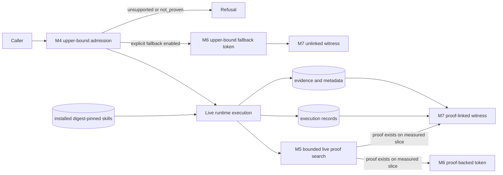
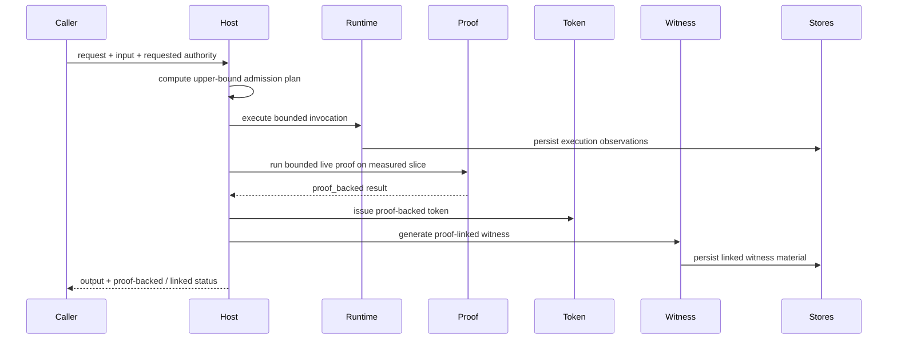
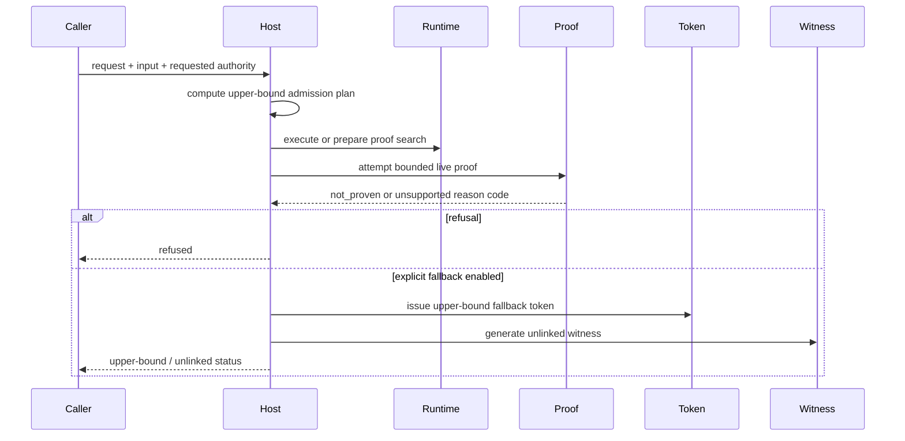
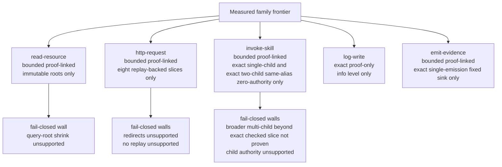
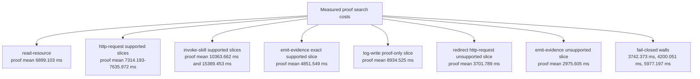

# M9 Figure Source Set

These figures are source material for counsel. They are intentionally measured and bounded. They should be read together with [`benchmark_matrix.json`](../schemas/draft-v1/benchmark_matrix.json), [`family_support_matrix.json`](../schemas/draft-v1/family_support_matrix.json), and [m9-non-claims.md](./m9-non-claims.md).

## F1 Architecture Figure Source

## F2 Supported Proof-Backed Path

## F3 Unsupported Or Fail-Closed Path

## F4 Family Support Frontier

## F5 Benchmarking Result Figure Source

## Figure Use Notes

- F1 is the high-level architecture figure source.
- F2 is the supported proof-backed sequence.
- F3 is the unsupported or fail-closed sequence.
- F4 is the measured family support frontier.
- F5 is the benchmarking and overhead summary.
