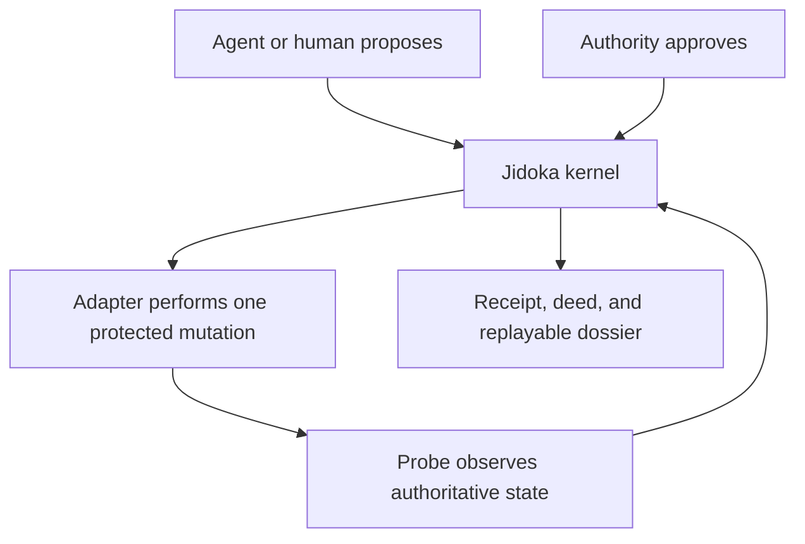
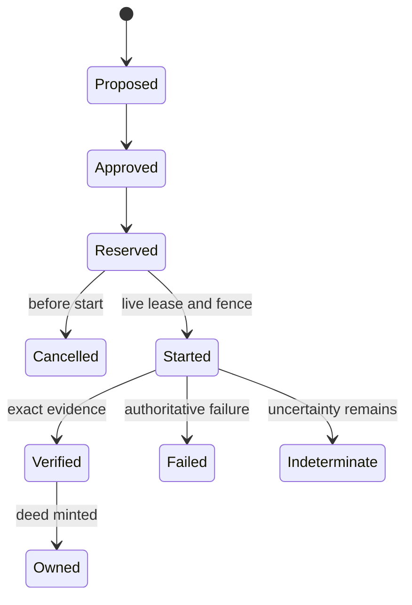

<!--
Provenance (non-normative): imported from jkordish/jidoka commit
78ace548bdfbf7bd354c0d97e22f71b3dfd6526f at
docs/superpowers/specs/2026-09-01-jidoka-autonomous-change-kernel-recovered-design.md.
The verbatim imported source body's SHA-256, before the ledgered §6.1
scalar-grammar clarification, is
86df64803cd2da89f6d6499aac4f884184b2799122a8f2e5e4cc7f9f178b177b.
The current normative body, from the first H1 through EOF after that
clarification, has SHA-256
b38d65617c6922c01c542e5d702aeba9b0866d2119250a4f5e8e83dd4b172f1d.
The normative protocol begins at the first H1 below. Guild ownership changes
and the scalar-grammar clarification are recorded separately and do not alter
v1 wire identity.
-->


# Jidoka: Autonomous Change Kernel

**Status:** Recovered approved design, pending recovery review

**Recovered:** 2026-09-01

**Owner:** Joseph Kordish

**Initial proving ground:** A new Apple Silicon development workstation

**Intended reach:** Any external system whose mutations can be bounded, observed, and verified

> Recovery note: the original approved design and its unpushed implementation were lost when the ephemeral worktree was pruned. This document reconstructs the approved architecture from the surviving decision record and completed review rulings. It is not represented as byte-for-byte recovery. Where the record preserved a ruling, this document keeps it. Where only the intent survived, this document makes the narrowest explicit choice consistent with that intent.

## 1. The decision

Jidoka is not an AI provisioning agent. We already have those. An agent with a shell can install Homebrew, run Terraform, edit a file, or destroy an account with equal enthusiasm.

Jidoka is the deterministic kernel between an autonomous actor and a consequential mutation. It decides whether a proposed change is authorized to start, records exactly which external effect may occur, admits evidence after the attempt, and derives a durable conclusion about custody. The AI is replaceable. The tools are replaceable. The proof rules are not.

The unique product is **proof-carrying change**:

- intent becomes a content-addressed warrant;
- authority becomes an exact, expiring approval;
- execution receives a single-use lease and fence;
- observation becomes typed evidence;
- a started attempt ends exactly once in a receipt;
- exact verified custody may mint a deed;
- every conclusion can be replayed from an anchored event chain without trusting an agent's memory or prose.

Jidoka therefore does less than a configuration manager and guarantees more about the narrow part it owns. It does not choose cloud resources, call package managers, or invent remediation. It provides the laws under which any actor may attempt those operations and the evidence required before anyone may claim they succeeded.

## 2. Scope of the first kernel

The first release proves the model with one deliberately small effect family: publishing a static artifact to a logical address, then separating that artifact into quarantine when custody must be withdrawn.

A local file copied into a workstation path is the first adapter. An S3 object, Terraform-produced resource, container image, signed release, DNS record, or Kubernetes object can later use the same kernel if its adapter supplies an exact input schema, precondition schema, protected mutation boundary, and authoritative probe.

### 2.1 Goals

1. Provide a pure deterministic Rust core with no filesystem, network, process, clock, randomness, or environment access.
2. Make every authorized external mutation single-attempt, fenced, replayable, and terminal exactly once.
3. Separate command success from observed postcondition and observed postcondition from causality.
4. Produce portable, content-addressed dossiers that any agent or tool can inspect and independently replay for internal consistency, then compare with an independently authenticated head anchor for freshness.
5. Recover safely after process loss without repeating a protected external mutation.
6. Support withdrawal of custody without erasing the history or deed that established it.
7. Keep the first implementation small enough that its state machine can be exhaustively reasoned about.

### 2.2 Non-goals

- Jidoka does not contain an LLM loop, chat interface, planner, provider SDK, shell runner, Terraform wrapper, or package manager.
- Jidoka does not infer desired state from natural language.
- Jidoka does not treat YAML, Terraform state, a command exit code, or an AI summary as proof.
- Jidoka does not promise distributed transactions across systems it does not control.
- Jidoka does not roll back an effect by guessing an inverse command.
- Jidoka does not hide uncertainty to produce a cleaner dashboard.
- The first kernel does not define signatures, remote consensus, a daemon, a database, or a general plugin ABI.
- The first kernel does not replace the existing workstation-oriented Jidoka v2 design. That design becomes an adapter and policy consumer of this kernel rather than the kernel itself.

## 3. System boundary

The kernel accepts values and returns values. The caller owns all I/O.



The adapter may be a Rust program, shell script, Terraform runner, cloud controller, CI job, or human procedure. Jidoka never trusts the adapter's brand or implementation. It trusts only admitted canonical inputs, exact state transitions, and evidence that satisfies the registered schema and protocol.

The core is deterministic with respect to:

- the current immutable body store;
- the anchored event history;
- explicit time supplied by the enrolled trusted-clock boundary;
- the proposed command value;
- canonical observations supplied by a probe boundary.

No core result depends on an internally read clock, map iteration order, host locale, filesystem ordering, thread timing, or model output. Real-time claims such as the five-second lease are only as trustworthy as the enrolled outer clock. The core enforces monotonicity and bounds; the deployment authenticates the clock source.

## 4. Vocabulary

| Term | Meaning |
|---|---|
| Artifact | Immutable content identified by a digest and a human-safe artifact name. |
| Logical address | Stable tool-agnostic name for the place custody is expected, not a provider-specific URI. |
| Installation | One enrolled kernel deployment and its incarnation. Content alone never proves which installation acted. |
| Warrant | Content-addressed proposal authorizing one exact effect over one exact resource under bounded policy. |
| Approval | Authority's consent to one exact warrant digest. Approval is not transferable to a changed warrant. |
| Lease | A single-use, five-second right to start one protected mutation. |
| Fence | Monotonic value preventing a stale actor from starting after a newer reservation supersedes it. |
| Idempotency binding | Permanent association between an idempotency key and the exact effect identity it first named. |
| Evidence | Typed observation plus limitations, captured independently of the effect command's report. |
| Causality | Assessment of whether the observed incarnation is the one prepared for this attempt. |
| Receipt | Exactly one terminal record for a started effect: Verified, Failed, or Indeterminate. |
| Deed | Strong custody claim minted only from an exact postcondition, exact prepared incarnation, and no evidence limitation. |
| Dossier | Portable graph of canonical bodies plus an anchored event head and derived summary. |
| Projection | Deterministic state reconstructed from the event chain. Never an independent source of truth. |
| Separation | Authorized removal of an artifact from active custody into quarantine. |

## 5. Kernel laws

These are invariants, not operational advice.

### 5.1 Identity and encoding

1. Every identity-bearing body is validated, serialized according to RFC 8785 JSON Canonicalization Scheme, and hashed with SHA-256.
2. Digests use exactly `sha256:` followed by 64 lowercase hexadecimal digits.
3. Inputs reject uppercase hex, missing prefixes, the wrong length, invalid characters, and the computed all-zero SHA-256 sentinel.
4. JSON integers must be safe across deterministic JSON implementations: `0..=9_007_199_254_740_991` unless represented by the dedicated decimal-string `U64Decimal` type.
5. Object variants reject unknown fields. Enums are closed and exhaustively matched.
6. A body digest identifies content. It never proves authorship, approval, installation incarnation, external existence, or custody.
7. Identity-bearing code must call `validated_body`; generic canonical byte and digest helpers remain encoding primitives for probe inputs and tests, not an alternate identity path.
8. Every validity interval is half-open. A warrant or lease is valid while `now < expiresAt`; equality is expired.

### 5.2 Graph integrity

1. Bodies are immutable and addressed by digest.
2. Every typed reference must resolve to a body of the exact permitted kind.
3. The registry validates the reachable graph, not only the root object.
4. Unknown kinds, forbidden edges, missing references, type-confused references, and cycles where the manifest forbids cycles fail closed.
5. Raw content hashes are explicitly distinguished from body references. In particular, `XattrEntry.value_digest` is a raw value hash; `quarantineXattrDigest` is an `XattrValue` body reference.

### 5.3 Authorization and start

1. Approval binds to one warrant digest and one installation incarnation.
2. A warrant binds the effect kind, resource identity, input digest, precondition digest, budgets, expiry, and policy generation.
3. A reservation holds both reservation and start budgets and creates an immutable idempotency binding before a lease is issued.
4. A lease is valid for exactly five seconds. Equality with its deadline is expired.
5. Starting requires a live lease, the current fence, the original binding, an approved and unrevoked warrant, unchanged admission facts, and an unused start slot.
6. Cancellation before start retains the idempotency binding, effect identity, and fence while releasing reserved budgets. It produces no receipt.
7. Once `EffectStarted` is committed, cancellation is impossible. The attempt must terminalize.

### 5.4 Completion

1. Every started attempt produces exactly one terminal receipt.
2. Only `Verified`, `Failed`, and `Indeterminate` are terminal receipt states.
3. A command's report is evidence about the command, not proof of the postcondition.
4. Postcondition and causality are separate decisions. Matching bytes do not prove that this attempt created the observed incarnation.
5. Recovery may re-probe and classify. It must never repeat the protected mutation.
6. A deed is minted only when the exact requested postcondition exists, the exact prepared incarnation caused it, and the evidence limitations set is empty.

### 5.5 Custody and separation

1. A deed is retained after separation; history is not rewritten to pretend custody never existed.
2. Every terminalized started separation increments custody generation exactly once, including authoritative safe no-move. Pre-start refusal or cancellation does not increment it.
3. Verified separation produces `Quarantined` custody.
4. Authoritative proof that no move occurred preserves `Owned` custody at the incremented generation.
5. Ambiguous separation produces `Disputed` custody.
6. A stale or duplicate terminalization cannot increment generation again.

## 6. Canonical value model

### 6.1 Scalars

The core exposes validated scalar newtypes rather than accepting ambient strings and integers:

- `Digest`: canonical SHA-256 identity string.
- `Hex256`: exactly 64 lowercase hex digits without an algorithm prefix.
- `Identifier`: ASCII matching `^[a-z0-9]+(?:-[a-z0-9]+)*$`, with total byte length `1..=63`. Digit endpoints are admitted; empty hyphen-separated segments, uppercase letters, underscores, and leading or trailing hyphens are forbidden.
- `FieldName`: ASCII matching `^[a-z][A-Za-z0-9]{0,62}$`, with total byte length `1..=63`.
- `XattrName`: 1 to 255 visible ASCII characters excluding `=` and NUL; stored byte-for-byte.
- `LogicalAddress`: 1 to 255 printable ASCII characters, already canonicalized by the adapter; no control characters or surrounding whitespace. The core stores it byte-for-byte and performs no normalization.
- `ArtifactName`: 1 to 255 Unicode scalar values; not empty after trimming; no NUL. The validated original value is stored byte-for-byte; trimming is a validity check, not a transformation, and no Unicode normalization occurs.
- `IdempotencyKey`: 16 to 128 visible ASCII characters; opaque and case-sensitive.
- `SafeUInt`: JSON-safe unsigned integer.
- `U64Decimal`: canonical unsigned 64-bit decimal string with no sign or leading zero except `0`.
- `UnixSeconds` and `UnixNanoseconds`: canonical unsigned decimal strings with checked arithmetic. Nanoseconds are never encoded as a JSON number because current epoch values exceed the JSON-safe integer range.
- `ByteLength`: a `U64Decimal`-backed byte count.
- `IncarnationId`: `sha256:` plus 64 lowercase hex digits, hashing an adapter-defined canonical external identity statement; it is a raw external identity, not a body reference.
- `ResourceKey` and `EffectId`: `sha256:` plus 64 lowercase hex digits derived by the kernel from canonical protocol tuples; they are not body references.

Construction is fallible. Deserialization calls the same constructors. `ValidationError` is closed so consumers must deliberately handle every failure class.

### 6.2 Canonical bodies

An identity-bearing body has:

- a closed `kind` discriminator;
- a schema version encoded in that kind;
- a concrete Rust payload with `deny_unknown_fields`;
- validated outbound references;
- canonical JSON bytes;
- a digest computed only after validation.

`canonical_bytes<T: Serialize>` and `canonical_digest<T: Serialize>` exist for deterministic encoding and probe primitives. They do not accept a value into the immutable body graph. `validated_body` is the sole public path from typed body to graph identity.

Canonical parsing rejects duplicate object members recursively before Serde deserialization. Generic canonicalization also rejects every JSON number outside `SafeUInt`, negative numbers, fractions, exponent notation that does not round-trip to the admitted integer model, and non-finite values. This is stricter than accepting a parse and choosing the first or last value because either behavior makes signatures, hashes, and human review disagree.

The canonical identity preimage is exactly:

```json
{"body":{},"kind":"registered-kind/v1"}
```

`body` is replaced by the concrete payload. Field names are lower camel case. Body-kind values are lower kebab-case followed by `/v1`. Protocol enum values and event-type values are lowercase snake case. Arrays whose order has no protocol meaning must already be strictly sorted by canonical byte ordering and contain no duplicates. Arrays whose order has protocol meaning say so explicitly.

A stored body is the canonical identity preimage bytes keyed by their computed digest. The digest is not embedded in or hashed as part of the preimage. `BodyRef<K>` is encoded as a digest string and is a typed graph edge to kind `K`. `RawDigest` uses the same string encoding but is not a graph edge. Untagged optional members and omitted fields are forbidden. An optional `T` is the closed union `Absent<T> { state: "absent" } | Present<T> { state: "present", value: T }`.

This exact UTF-8 byte sequence is the canonical-body golden example; it has no trailing newline:

```json
{"body":{"logicalAddress":"local-file:///canonical/path","observedAt":"1788210000000000000","state":"absent","witnessId":"host-probe"},"kind":"local-file-observation/v1"}
```

Its identity is `sha256:37acdc8236b6c57c87a7d68b0ed51cf02d9a97ba78edd6d13a3b3f754000cf81`.

### 6.3 Registered effect schemas

The first kernel has a closed schema registry. Schema descriptors are code, not runtime plugins. Each descriptor identifies the only admitted fields and validation constraints for one payload.

| Schema ID | Fields |
|---|---|
| `local-file-observation/v1` | Closed `present` or `absent` observation defined below. |
| `static-artifact-publish-input/v1` | `artifactName`, `sourceObservationDigest`, `targetLogicalAddress` |
| `static-artifact-publish-precondition/v1` | `targetLogicalAddress`, `expectedTarget`, `expectedCustodyGeneration` |
| `static-artifact-separation-input/v1` | `deedDigest`, `quarantineAddress`, `quarantineXattrDigest` |
| `static-artifact-separation-precondition/v1` | `expectedActive`, `expectedQuarantine`, `expectedCustodyGeneration` |

The payload union is closed; an unknown schema ID is invalid even if its JSON shape resembles a known payload.

`local-file-observation/v1` is an explicit authoritative witness statement. Absence is never inferred from a missing body:

```json
{"logicalAddress":"local-file:///canonical/path","observedAt":"1788210000000000000","state":"absent","witnessId":"host-probe"}
```

```json
{"artifactName":"app","byteLength":"42","contentDigest":"sha256:e3b0c44298fc1c149afbf4c8996fb92427ae41e4649b934ca495991b7852b855","incarnation":"sha256:ca978112ca1bbdcafac231b39a23dc4da786eff8147c4e72b9807785afee48bb","logicalAddress":"local-file:///canonical/path","observedAt":"1788210000000000000","quarantineXattrDigest":{"state":"absent"},"state":"present","witnessId":"host-probe"}
```

The `absent` variant permits exactly `state`, `logicalAddress`, `witnessId`, and `observedAt`. The `present` variant additionally requires `artifactName`, raw `contentDigest`, `byteLength`, `incarnation`, and tagged `quarantineXattrDigest`. The witness must be enrolled in the immutable authority policy, and the outer coordinator must authenticate the probe response before admission. `incarnation` names a stable external generation, not merely file contents. A present `quarantineXattrDigest` references an `XattrValue` body.

`static-artifact-publish-input/v1` references a present source observation. The input's artifact name must equal the observation's artifact name. Content digest, byte length, source address, and prepared incarnation are derived from that observation; callers do not repeat them. The target address must differ from the source address.

`expectedTarget` is exactly `AbsentExpectedState { state: "absent" }` or `PresentExpectedState { state: "present", artifactName: ArtifactName, contentDigest: RawDigest, byteLength: ByteLength, incarnation: IncarnationId }`. `expectedCustodyGeneration` is `Optional<CustodyGeneration>`: absent when no custody record exists, present only for an exact current `Absent` record. Admission requires a fresh authenticated target observation whose state fields equal the expectation; witness identity and observation time are deliberately excluded from equality.

`static-artifact-separation-input/v1` references the current deed and the required `XattrValue` body. Active address, artifact, content, incarnation, and current generation are derived from the deed plus custody projection. Quarantine address must produce a different resource key from the active address.

`expectedActive` must be a `present` expectation exactly matching the deed. `expectedQuarantine` must be an `absent` expectation at the input's quarantine address. Admission requires fresh authenticated observations satisfying both expectations and the exact projected generation.

`XattrValue` contains a sorted, duplicate-free list of `XattrEntry { name, valueDigest, byteLength }`. `name` is a validated `XattrName`. `valueDigest` hashes the raw xattr value bytes and is not a body reference. `byteLength` covers those same raw bytes. The list contains metadata only; the core never stores or interprets the raw xattr value. A `quarantineXattrDigest` field, by contrast, is a typed body reference to the complete `XattrValue` body.

## 7. Immutable body graph

The registry admits exactly these 29 body kinds in the first model:

1. `installation-enrollment/v1`
2. `authority-policy/v1`
3. `schema-descriptor/v1`
4. `local-file-observation/v1`
5. `xattr-value/v1`
6. `static-artifact-publish-input/v1`
7. `static-artifact-publish-precondition/v1`
8. `static-artifact-separation-input/v1`
9. `static-artifact-separation-precondition/v1`
10. `publication-warrant/v1`
11. `publication-approval/v1`
12. `publication-revocation/v1`
13. `effect-lease/v1`
14. `idempotency-binding/v1`
15. `prepared-artifact/v1`
16. `publication-evidence/v1`
17. `causality-assessment/v1`
18. `effect-receipt/v1`
19. `resource-deed/v1`
20. `separation-warrant/v1`
21. `separation-approval/v1`
22. `separation-revocation/v1`
23. `separation-lease/v1`
24. `separation-binding/v1`
25. `separation-evidence/v1`
26. `separation-receipt/v1`
27. `custody-record/v1`
28. `recovery-assessment/v1`
29. `dossier-summary/v1`

### 7.1 Normative body layouts

The following aliases are normative:

- `PrincipalId`, `WitnessId`, `BudgetKey`, `PolicyId`, and `InstallationId` are `Identifier` values.
- `Fence`, `PolicyGeneration`, and `CustodyGeneration` are `U64Decimal` values.
- `ContentDigest` and `IncarnationId` are `RawDigest` values, not body references.
- `BudgetAmount` is a nonzero `SafeUInt`.
- `ResourceFence` is `{ resourceKey: ResourceKey, fence: Fence }`.
- `BudgetClaim` and `BudgetHold` are `{ key: BudgetKey, amount: BudgetAmount }`.
- `ExpectedState` is the closed `absent` or `present` state shape defined in §6.3.
- `EvidenceLimitation` is one of `witness_unavailable`, `unsupported_identity`, `non_atomic_external_operation`, `stale_observation`, or `conflicting_observation`.
- `CommandReport` is one of `reported_success`, `reported_no_effect`, `reported_uncertain`, or `not_available`. Only recovery may use `not_available`.
- `FieldType` is one of `observation_state`, `logical_address`, `witness_id`, `unix_nanoseconds`, `artifact_name`, `raw_digest`, `byte_length`, `incarnation_id`, `optional_body_ref_xattr_value`, `body_ref_local_file_observation`, `body_ref_resource_deed`, `body_ref_xattr_value`, `expected_state`, `present_expected_state`, `absent_expected_state`, `optional_custody_generation`, or `custody_generation`.
- `PublicationPostcondition` is one of `exact_requested`, `authoritative_absence`, `prior_state_unchanged`, `content_mismatch`, or `ambiguous`.
- `SeparationPostcondition` is one of `exact_quarantine`, `no_move`, or `ambiguous`.
- `ProtocolRef<P, S>` is the closed union `{ protocol: "publication", digest: BodyRef<P> } | { protocol: "separation", digest: BodyRef<S> }`.
- `Optional<T>` is the closed union `{ state: "absent" } | { state: "present", value: T }`.
- `ObservationEvidence` is the closed union `{ state: "observed", digest: BodyRef<local-file-observation/v1> } | { state: "unavailable", logicalAddress: LogicalAddress, witnessId: WitnessId, attemptedAt: UnixNanoseconds } | { state: "unsupported", logicalAddress: LogicalAddress, witnessId: WitnessId, attemptedAt: UnixNanoseconds } | { state: "conflicting", logicalAddress: LogicalAddress, witnessId: WitnessId, attemptedAt: UnixNanoseconds, observationDigests: [BodyRef<local-file-observation/v1>] }`. Conflicting digests are sorted, unique, number at least two, and name the same address. None of the three non-observed variants is authoritative absence.
- Every list described as a set is strictly sorted by canonical bytes and duplicate-free. Policy principal/budget lists and conflicting-observation lists are each length-bounded to 1,024 entries. Exhaustive derived dossier lists are not truncated.

All listed fields are required. A closed variant permits only the fields listed for that variant.

| Body kind | Exact payload fields and constraints |
|---|---|
| `installation-enrollment/v1` | `installationId: InstallationId`; `incarnation: IncarnationId`; `policyDigest: BodyRef<authority-policy/v1>`; `enrolledAt: UnixNanoseconds`. |
| `authority-policy/v1` | `policyId: PolicyId`; `generation: PolicyGeneration` equal to `0`; nonempty sorted sets `proposerIds`, `approverIds`, `revokerIds`, `witnessIds`; `requireDistinctApprovalPrincipal: bool` equal to `true`; sorted unique `reservationBudgets` and `startBudgets` of `{ key, capacity: SafeUInt }`; `trustedClockId: Identifier`; `trustedStoreId: Identifier`. Budget keys are unique across each list. |
| `schema-descriptor/v1` | `schemaId` from the closed five-schema ID enum; `fields`, a sorted list of `{ name: FieldName, fieldType: FieldType, required: bool }`. It must byte-for-byte equal the descriptor compiled into the matching schema implementation. |
| `local-file-observation/v1` | Exact `absent` or `present` variant from §6.3. `contentDigest` and `incarnation` are raw digests. Present `quarantineXattrDigest.value` is `BodyRef<xattr-value/v1>`. |
| `xattr-value/v1` | `entries`, a sorted set of `{ name: XattrName, valueDigest: RawDigest, byteLength: ByteLength }`; at least one entry. |
| `static-artifact-publish-input/v1` | `artifactName: ArtifactName`; `sourceObservationDigest: BodyRef<local-file-observation/v1>` naming a present observation; `targetLogicalAddress: LogicalAddress`. Source and target addresses differ. |
| `static-artifact-publish-precondition/v1` | `targetLogicalAddress: LogicalAddress`; `expectedTarget: ExpectedState`; `expectedCustodyGeneration: Optional<CustodyGeneration>`. Its address equals the input target and its generation tag follows the publication-admission matrix in §11.1. |
| `static-artifact-separation-input/v1` | `deedDigest: BodyRef<resource-deed/v1>`; `quarantineAddress: LogicalAddress`; `quarantineXattrDigest: BodyRef<xattr-value/v1>`. Active and quarantine resource keys differ. |
| `static-artifact-separation-precondition/v1` | `expectedActive: PresentExpectedState`; `expectedQuarantine: AbsentExpectedState`; `expectedCustodyGeneration: CustodyGeneration`. Values exactly match the input deed, quarantine address, and current projection when admitted. |
| `publication-warrant/v1` | `installationDigest: BodyRef<installation-enrollment/v1>`; `policyDigest: BodyRef<authority-policy/v1>`; `policyGeneration: PolicyGeneration` equal to the referenced policy; `effectKind` literal `static_artifact_publish`; `proposerId: PrincipalId`; `inputDigest: BodyRef<static-artifact-publish-input/v1>`; `preconditionDigest: BodyRef<static-artifact-publish-precondition/v1>`; `idempotencyKey: IdempotencyKey`; sorted two-element `resourceKeys: [ResourceKey]`; `reservationBudget: BudgetClaim`; `startBudget: BudgetClaim`; `issuedAt`, `expiresAt: UnixNanoseconds`; `nonce: Hex256`. Keys are exactly the source and target address keys. |
| `publication-approval/v1` | `warrantDigest: BodyRef<publication-warrant/v1>`; `approverId: PrincipalId`; `approvedAt: UnixNanoseconds`. Approver is enrolled and, because policy requires it, differs from proposer. |
| `publication-revocation/v1` | `warrantDigest: BodyRef<publication-warrant/v1>`; `revokerId: PrincipalId`; `revokedAt: UnixNanoseconds`; `reason: Identifier`. |
| `effect-lease/v1` | `effectId: EffectId`; `bindingDigest: BodyRef<idempotency-binding/v1>`; sorted two-element `resourceFences: [ResourceFence]`; `reservationBudgetHold`, `startBudgetHold: BudgetHold`; `reservedAt`, `expiresAt: UnixNanoseconds`, with expiry exactly five seconds after reservation. |
| `idempotency-binding/v1` | `idempotencyKey: IdempotencyKey`; `effectId: EffectId`; `warrantDigest: BodyRef<publication-warrant/v1>`. |
| `prepared-artifact/v1` | `effectId: EffectId`; `bindingDigest: BodyRef<idempotency-binding/v1>`; `inputDigest: BodyRef<static-artifact-publish-input/v1>`; `sourceBeforeObservationDigest`, `targetBeforeObservationDigest: BodyRef<local-file-observation/v1>`; derived `contentDigest: RawDigest`, `byteLength: ByteLength`, `preparedIncarnation: IncarnationId`; `preparedAt: UnixNanoseconds`. Source is present and exactly matches the input; target satisfies the precondition. |
| `publication-evidence/v1` | `effectId: EffectId`; `bindingDigest: BodyRef<idempotency-binding/v1>`; `preparedArtifactDigest: BodyRef<prepared-artifact/v1>`; `commandReport: CommandReport`; `sourceBeforeObservationDigest`, `targetBeforeObservationDigest: BodyRef<local-file-observation/v1>`; `sourceAfter`, `targetAfter: ObservationEvidence`; `postcondition: PublicationPostcondition`; sorted set `limitations: [EvidenceLimitation]`; `assessedAt: UnixNanoseconds`. Before digests equal those in the start event. Postcondition and limitations are derived from this self-contained evidence bundle. |
| `causality-assessment/v1` | `effectId: EffectId`; `evidenceDigest: BodyRef<publication-evidence/v1>`; `outcome` one of `exact_prepared_incarnation`, `different_incarnation`, `duplicate_incarnation`, `ambiguous`, `unsupported`. Outcome is derived independently of postcondition and has no reason field. |
| `effect-receipt/v1` | `effectId: EffectId`; `bindingDigest: BodyRef<idempotency-binding/v1>`; `evidenceDigest: BodyRef<publication-evidence/v1>`; `causalityDigest: BodyRef<causality-assessment/v1>`; `state` one of `verified`, `failed`, `indeterminate`; `result` and `reason` from §9.2; `terminalAt: UnixNanoseconds`. All classification fields are derived by §9.4. |
| `resource-deed/v1` | `resourceKey: ResourceKey`; `logicalAddress: LogicalAddress`; `artifactName: ArtifactName`; `contentDigest: RawDigest`; `byteLength: ByteLength`; `incarnation: IncarnationId`; `publicationReceiptDigest: BodyRef<effect-receipt/v1>`; `custodyGeneration: CustodyGeneration`, equal to the next generation from §11.1. Every field is derived by the private deed proof. |
| `separation-warrant/v1` | `installationDigest: BodyRef<installation-enrollment/v1>`; `policyDigest: BodyRef<authority-policy/v1>`; `policyGeneration: PolicyGeneration` equal to the referenced policy; `effectKind` literal `static_artifact_separation`; `proposerId: PrincipalId`; `inputDigest: BodyRef<static-artifact-separation-input/v1>`; `preconditionDigest: BodyRef<static-artifact-separation-precondition/v1>`; `idempotencyKey: IdempotencyKey`; sorted two-element `resourceKeys: [ResourceKey]`; `reservationBudget: BudgetClaim`; `startBudget: BudgetClaim`; `issuedAt`, `expiresAt: UnixNanoseconds`; `nonce: Hex256`. Keys are exactly active and quarantine keys. |
| `separation-approval/v1` | `warrantDigest: BodyRef<separation-warrant/v1>`; `approverId: PrincipalId`; `approvedAt: UnixNanoseconds`. Approver is enrolled and differs from proposer. |
| `separation-revocation/v1` | `warrantDigest: BodyRef<separation-warrant/v1>`; `revokerId: PrincipalId`; `revokedAt: UnixNanoseconds`; `reason: Identifier`. |
| `separation-lease/v1` | `effectId: EffectId`; `bindingDigest: BodyRef<separation-binding/v1>`; sorted two-element `resourceFences: [ResourceFence]`; `reservationBudgetHold`, `startBudgetHold: BudgetHold`; `reservedAt`, `expiresAt: UnixNanoseconds`, with expiry exactly five seconds after reservation. |
| `separation-binding/v1` | `idempotencyKey: IdempotencyKey`; `effectId: EffectId`; `warrantDigest: BodyRef<separation-warrant/v1>`. |
| `separation-evidence/v1` | `effectId: EffectId`; `bindingDigest: BodyRef<separation-binding/v1>`; `deedDigest: BodyRef<resource-deed/v1>`; `activeBeforeObservationDigest`, `quarantineBeforeObservationDigest: BodyRef<local-file-observation/v1>`; `activeAfter`, `quarantineAfter: ObservationEvidence`; `commandReport: CommandReport`; `postcondition: SeparationPostcondition`; `limitations: [EvidenceLimitation]`; `assessedAt: UnixNanoseconds`. Before observations must be the exact ones committed with start; limitations are sorted and derived. |
| `separation-receipt/v1` | `effectId: EffectId`; `bindingDigest: BodyRef<separation-binding/v1>`; `evidenceDigest: BodyRef<separation-evidence/v1>`; `deedDigest: BodyRef<resource-deed/v1>`; `state` one of `verified`, `failed`, `indeterminate`; `result` and `reason` from §9.2; `terminalAt: UnixNanoseconds`; `nextCustodyGeneration: CustodyGeneration`, exactly current generation plus one. |
| `custody-record/v1` | `resourceKey: ResourceKey`; `deedDigest: Optional<BodyRef<resource-deed/v1>>`; `custodyGeneration: CustodyGeneration`; `state` one of `owned`, `quarantined`, `absent`, `disputed`; `terminalReceipt: ProtocolRef<effect-receipt/v1, separation-receipt/v1>`; `activeAddress: LogicalAddress`; `quarantineAddress: Optional<LogicalAddress>`. All cross-field values are uniquely derived by §9.5. |
| `recovery-assessment/v1` | `effectId: EffectId`; `bindingDigest: ProtocolRef<idempotency-binding/v1, separation-binding/v1>`; `evidenceDigest: ProtocolRef<publication-evidence/v1, separation-evidence/v1>`; `receiptDigest: ProtocolRef<effect-receipt/v1, separation-receipt/v1>`; `recoveredAt: UnixNanoseconds`; `state` one of `verified`, `failed`, `indeterminate`; `reason` from §9.2, equal to the referenced receipt. All three tagged references use the same protocol. |
| `dossier-summary/v1` | `installationDigest: BodyRef<installation-enrollment/v1>`; `policyDigest: BodyRef<authority-policy/v1>`; `claimedEventHead: RawDigest`; sorted `custodyRecordDigests: [BodyRef<custody-record/v1>]`; sorted `publicationReceiptDigests: [BodyRef<effect-receipt/v1>]`; sorted `separationReceiptDigests: [BodyRef<separation-receipt/v1>]`; `counts: { proposed, reserved, cancelled, started, verified, failed, indeterminate: U64Decimal }`; sorted `unresolvedEffectIds: [EffectId]`. Every field is derived by §9.5; it is never authoritative. |

### 7.2 Complete body-edge matrix

All body-graph cycles are forbidden. The only permitted typed edges are below; omission means the body has no body references. Tagged union edges permit only the listed targets.

| Source kind | Permitted target kinds |
|---|---|
| `installation-enrollment/v1` | `authority-policy/v1` |
| `local-file-observation/v1` | `xattr-value/v1` |
| `static-artifact-publish-input/v1` | `local-file-observation/v1` |
| `static-artifact-separation-input/v1` | `resource-deed/v1`, `xattr-value/v1` |
| `publication-warrant/v1` | `installation-enrollment/v1`, `authority-policy/v1`, `static-artifact-publish-input/v1`, `static-artifact-publish-precondition/v1` |
| `publication-approval/v1`, `publication-revocation/v1` | `publication-warrant/v1` |
| `idempotency-binding/v1` | `publication-warrant/v1` |
| `effect-lease/v1` | `idempotency-binding/v1` |
| `prepared-artifact/v1` | `idempotency-binding/v1`, `static-artifact-publish-input/v1`, `local-file-observation/v1` |
| `publication-evidence/v1` | `idempotency-binding/v1`, `prepared-artifact/v1`, `local-file-observation/v1` |
| `causality-assessment/v1` | `publication-evidence/v1` |
| `effect-receipt/v1` | `idempotency-binding/v1`, `publication-evidence/v1`, `causality-assessment/v1` |
| `resource-deed/v1` | `effect-receipt/v1` |
| `separation-warrant/v1` | `installation-enrollment/v1`, `authority-policy/v1`, `static-artifact-separation-input/v1`, `static-artifact-separation-precondition/v1` |
| `separation-approval/v1`, `separation-revocation/v1` | `separation-warrant/v1` |
| `separation-binding/v1` | `separation-warrant/v1` |
| `separation-lease/v1` | `separation-binding/v1` |
| `separation-evidence/v1` | `separation-binding/v1`, `resource-deed/v1`, `local-file-observation/v1` |
| `separation-receipt/v1` | `separation-binding/v1`, `separation-evidence/v1`, `resource-deed/v1` |
| `custody-record/v1` | `resource-deed/v1`, `effect-receipt/v1` or `separation-receipt/v1` |
| `recovery-assessment/v1` | `idempotency-binding/v1` or `separation-binding/v1`; `publication-evidence/v1` or `separation-evidence/v1`; `effect-receipt/v1` or `separation-receipt/v1`, with all three selected by one matching `ProtocolRef` tag |
| `dossier-summary/v1` | `installation-enrollment/v1`, `authority-policy/v1`, `custody-record/v1`, `effect-receipt/v1`, `separation-receipt/v1` |

The code contains an exhaustive manifest for every kind and this exhaustive edge matrix for every reference field. Adding a thirtieth kind fails compilation at every exhaustive match until its descriptor, permitted references, event payload use, and golden vectors are added.

### 7.3 Exact schema descriptors

Each entry below is `fieldName:fieldType:required`, sorted by field name. Conditional present-observation requirements remain enforced by the closed variant in §6.3; `required=false` means the field is illegal for `absent` and required for `present`, never freely optional.

| Schema ID | Exact descriptor entries |
|---|---|
| `local-file-observation/v1` | `artifactName:artifact_name:false`, `byteLength:byte_length:false`, `contentDigest:raw_digest:false`, `incarnation:incarnation_id:false`, `logicalAddress:logical_address:true`, `observedAt:unix_nanoseconds:true`, `quarantineXattrDigest:optional_body_ref_xattr_value:false`, `state:observation_state:true`, `witnessId:witness_id:true` |
| `static-artifact-publish-input/v1` | `artifactName:artifact_name:true`, `sourceObservationDigest:body_ref_local_file_observation:true`, `targetLogicalAddress:logical_address:true` |
| `static-artifact-publish-precondition/v1` | `expectedCustodyGeneration:optional_custody_generation:true`, `expectedTarget:expected_state:true`, `targetLogicalAddress:logical_address:true` |
| `static-artifact-separation-input/v1` | `deedDigest:body_ref_resource_deed:true`, `quarantineAddress:logical_address:true`, `quarantineXattrDigest:body_ref_xattr_value:true` |
| `static-artifact-separation-precondition/v1` | `expectedActive:present_expected_state:true`, `expectedCustodyGeneration:custody_generation:true`, `expectedQuarantine:absent_expected_state:true` |

Reference validation operates in two passes:

1. validate and index each body by the digest of its canonical bytes;
2. walk reachable typed edges from the requested roots, enforcing the exact target kind and graph rules.

Graph storage accepts no caller-supplied identity. The map key must equal the body's computed digest.

## 8. Warrants, approvals, leases, and budgets

### 8.1 Warrant

A publication or separation warrant contains:

- installation enrollment digest;
- policy digest and policy generation;
- effect kind;
- exact logical resource identity;
- input body digest;
- precondition body digest;
- reservation budget key and amount;
- start budget key and amount;
- issue time and expiry time;
- proposal nonce supplied as content, not generated by the core.

The warrant is a proposal until an approval body names its exact digest. The outer coordinator authenticates the proposer, approver, and revoker identities before admitting their bodies. Approval authority and proposal authority are distinct identifiers. Policy determines whether they may be the same principal; the first policy requires them to be distinct for publication and separation.

`issuedAt < expiresAt` is required. Approval must occur at or after issue and strictly before expiry. Each warrant admits at most one approval and one revocation event; replay of the identical body is idempotent, while a different approval or revocation for the same warrant is a conflict. A revocation requires an enrolled revoker and a previously approved warrant. An expiry event may appear at most once.

Revocation names an approved warrant digest and becomes effective at its explicit trusted-clock transition time. Expiry is derived from the warrant. Neither revocation nor expiry edits the warrant.

At `now >= expiresAt`, a warrant is expired. At `now >= revokedAt`, a revocation is effective. The caller supplies `now`; the core performs checked comparisons and never reads a clock.

Event times are nondecreasing. A transition time must be at least the anchored head event time. The coordinator must obtain time from the `trustedClockId` enrolled in policy and authenticate that source. Monotonic validation prevents backdating relative to history, but only the outer trusted clock prevents an actor from freezing time. Without that trust boundary, the kernel still preserves event ordering but makes no real-time five-second claim.

Revocation or expiry after a durable start does not cancel the started effect. Authorization is consumed at start; the attempt still must terminalize.

The authority policy and its generation are immutable for one event chain. The closed 26-event vocabulary intentionally has no policy-update event. Policy rotation, clock rotation, store rotation, principal changes, budget replenishment, and custody migration between chains are unsupported in the first kernel. A later protocol may start a new enrolled chain and explicitly import custody, but this design does not invent that transition.

### 8.2 Effect and resource identity

`ResourceKey` is the digest of canonical JSON containing `{ effectFamily: "static_artifact", logicalAddress }`. Publication locks the sorted set containing source and target keys because promotion mutates both addresses. Separation locks the sorted set containing active and quarantine keys. Two effects conflict exactly when their lock sets intersect.

The core treats `LogicalAddress` as opaque canonical input. An adapter must map every external resource it can mutate to one injective canonical address, resolving aliases such as symlinks, bucket aliases, case folding, or provider IDs before proposal. If the adapter cannot prove injectivity, it must refuse the warrant or add `unsupported_identity`; the core never guesses normalization.

`EffectId` is the digest of canonical JSON containing `{ installationDigest, warrantDigest, effectKind, resourceKeys, inputDigest, preconditionDigest }`. The idempotency key is already committed inside the warrant and is not a second source of effect identity.

Publication source is effect staging, not existing custody. Proposal and preparation reject a source key claimed by any current custody record, locked by any nonterminal effect, equal to the target key, or named by more than one present incarnation. The source observation must therefore describe unclaimed adapter staging that this publication may exclusively promote.

A warrant is one-shot:

- it may produce at most one permanent binding and one reservation;
- the same warrant and same idempotency key returns the existing state without new budgets, fences, or permits;
- the same warrant with a different key is impossible because the key is part of the warrant; a differently encoded proposal is a different warrant;
- after pre-start cancellation, the warrant remains spent and cannot reserve again;
- every later attempt requires a new warrant, nonce, effect identity, approval, and idempotency key.

### 8.3 Reservation

Reservation is a durable event, not a temporary in-memory lock. Admission verifies the projection, then proposes one atomic transition bundle containing the binding, lease, and reservation event. A successful durable head compare-and-swap:

- binds the idempotency key to the exact effect identity forever;
- moves both budget claims from `Available` to `Held`;
- assigns the next monotonic fence for the resource;
- identifies the approved warrant and current policy generation;
- issues a sealed lease whose deadline is `reservedAt + 5_000_000_000` nanoseconds.

`EffectLease` and `IdempotencyBinding` have private fields and serialize but do not deserialize through public constructors. They can only be minted by the admission logic from a valid projection.

Budget units have exactly three projection states: `Available`, `Held`, and `Consumed`. Enrollment initializes all units as Available from the immutable policy capacities. Reservation holds the warrant's reservation and start claims. Start moves both holds to Consumed. Pre-start cancellation moves both holds back to Available. Terminalization never replenishes consumed units. Underflow, overflow, duplicate hold, and duplicate consume make the history invalid.

Budget ledger identity is `(budgetClass, budgetKey)`, where class is exactly `reservation` or `start`. Equal text keys in the two policy lists therefore name two different pools. A warrant's reservation claim may address only the reservation ledger; its start claim may address only the start ledger.

Projection also maintains `resourceLocks: ResourceKey -> { effectId, fence }`. Reservation atomically requires every effect key to be absent from this map, assigns each next fence, and inserts every lock. Locks remain unchanged through `Reserved`, `Prepared`, and `Started`; start never releases them. Cancellation releases all locks for that effect. A terminal bundle releases them only when the bundle's final event commits. Fence counters remain after release and are never decremented. Admission checks this lock map for all nonterminal effects, including started effects.

Submitting the same idempotency key with the same effect returns the existing binding and does not hold budget again. Submitting it with any different effect is a hard conflict. A second key for the same warrant is also a hard conflict.

### 8.4 Start and cancellation

Start is admitted only if every reservation fact is still current. A successful atomic commit consumes both held budget claims and records `EffectStarted` before the caller crosses the protected mutation boundary.

The only pre-start cancellation reasons are:

- `request_disconnected`
- `reservation_deadline`
- `authorization_ineligible`
- `peer_identity_changed`
- `precondition_changed`
- `recovery_orphaned`

`budget_unavailable` remains in the closed pre-start outcome vocabulary but is a reservation refusal before a binding, lease, or reserved event exists. It is not legal in a cancellation event because an accepted reservation already holds both claims.

Cancellation releases both held claims in full because the protected mutation never began. It never removes the idempotency binding, rewinds the fence, reopens the warrant, or creates a receipt.

The adapter must perform a just-in-time permit check immediately before mutation. Where the external target supports conditional mutation, it must bind the operation to the admitted precondition and fence-equivalent provider token. Where it cannot, the adapter declares `non_atomic_external_operation`; any intervening state change makes the result Indeterminate rather than silently claiming causality.

### 8.5 Temporal invariants

All events in one transition bundle use the same trusted `transitionAt` as `occurredAt`. Bundle times are nondecreasing relative to the anchored head. Body and event times obey all of these rules:

| Transition | Required temporal relation |
|---|---|
| Enrollment | `enrollment.enrolledAt == installation_enrolled.occurredAt`. |
| Warrant proposal | `issuedAt <= warrant_proposed.occurredAt < expiresAt`. |
| Approval | `approvedAt == warrant_approved.occurredAt`; proposal time `<= approvedAt < expiresAt`. |
| Revocation | `revokedAt == warrant_revoked.occurredAt`; approval time `<= revokedAt`. |
| Expiry event | `warrant_expired.occurredAt >= expiresAt`. |
| Reservation | `reservedAt == effect_reserved/separation_reserved.occurredAt`; approval time `<= reservedAt < warrant.expiresAt`; lease expiry is exactly `reservedAt + 5_000_000_000`. |
| Preparation | `preparedAt == artifact_prepared.occurredAt`; reservation time `<= each preparation observation.observedAt <= preparedAt`. |
| Start admission | Each start-bound before-observation satisfies `reservedAt <= observedAt <= startAt` and `startAt - observedAt <= 5_000_000_000`; `startAt < lease.expiresAt`. |
| Start event | `startAt == effect_started/separation_started.occurredAt`; preparation time `<= startAt` for publication. |
| Live evidence | Every after-evidence timestamp is `<= assessedAt`; a timestamp `< startAt` derives `stale_observation` instead of making the body unrepresentable; `evidence.assessedAt == receipt.terminalAt == terminal bundle occurredAt`. |
| Recovery evidence | Every after-evidence timestamp is `<= recoveredAt`; a timestamp `< startAt` derives `stale_observation`; `evidence.assessedAt == receipt.terminalAt == recoveryAssessment.recoveredAt == terminal bundle occurredAt`. |
| Cancellation | Reservation time `<= cancellation.occurredAt`; `reservation_deadline` additionally requires cancellation time `>= lease.expiresAt`. |

Admission freshness refers only to the before-observations bound into start. Terminal freshness refers only to after-observations used for classification. Before-observations are expected to precede or equal the start event and are never tested against the terminal freshness rule.

### 8.6 Counter origin, reservation, and exhaustion

All fence, generation, and event-sequence arithmetic is checked against `U64Decimal::MAX = 18_446_744_073_709_551_615`.

- A resource with no fence receives fence `1` on its first reservation. Zero is never an assigned fence. Every later reservation uses checked `current + 1`. A multi-resource separation refuses atomically if either successor is unavailable.
- A resource with no custody record receives publication generation `0`. Every later publication from `Absent` and every separation uses checked `current + 1`.
- Fence or generation exhaustion returns closed `AdmissionError::CounterExhausted` before a binding, budget hold, start, or external mutation. Separation generation exhaustion is checked at reservation and checked again at start.
- Genesis event sequence is `0`; every later event uses checked `previous + 1`.

Projection maintains `terminalSequenceReserve`, derived from started unterminated effects: three slots for each publication and two for each separation. Let `remaining = U64Decimal::MAX - currentHeadSequence` and `reserved` be the current total reserve.

- Any ordinary `k`-event bundle must satisfy `remaining >= reserved + k`.
- A publication start bundle must satisfy `remaining >= reserved + 1 + 3`; after commit it adds a three-slot reserve.
- A separation start bundle must satisfy `remaining >= reserved + 1 + 2`; after commit it adds a two-slot reserve.
- A publication terminal bundle consumes two or three events from its three-slot reserve, then releases the unused slot if any.
- A separation terminal bundle consumes one or two events from its two-slot reserve, then releases the unused slot if any.

One bundle terminalizes at most one effect. Reserve summation, addition, and subtraction are checked; arithmetic failure is sequence exhaustion. Other proposals, approvals, revocations, expiries, reservations, preparations, starts, and cancellations may not consume slots reserved for existing starts. Sequence-capacity failure returns `AdmissionError::SequenceExhausted` before commit. This makes eventual terminalization representable even if unrelated events interleave until only the reserved slots remain.

## 9. Evidence, receipts, and deeds

### 9.1 Evidence pipeline

Evidence is created from an authoritative probe after start or during recovery. It contains:

- the started effect and its start-bound before-observations;
- a closed after-evidence value for every required address;
- the command report or recovery's `not_available` marker;
- independently derived postcondition;
- independently derived publication causality assessment;
- a sorted, duplicate-free set of derived evidence limitations.

Evidence bodies and assessments have private fields and crate-private validated replay decoders. Callers submit probe attempts and authenticated adapter context; they cannot choose postcondition, causality, or limitations. The evidence constructor derives limitations exactly as follows:

| Input fact | Required limitation |
|---|---|
| Any after-evidence variant is `unavailable` | `witness_unavailable` |
| Any variant is `unsupported`, an observed incarnation fails the adapter's enrolled identity rules, or witness authentication/enrollment fails | `unsupported_identity` |
| Any variant is `conflicting` | `conflicting_observation` |
| Any after-evidence timestamp is before start | `stale_observation` |
| The start event's `mutationMode` is `unconditional` | `non_atomic_external_operation` |

No other limitation value may be inserted. Multiple facts produce the sorted set of all applicable limitations. A timestamp after assessment is invalid rather than a limitation. A non-observed attempt timestamp is still explicit and checked.

Postcondition answers: **does authoritative state now match the exact requested state?**

Causality answers: **does that state have the exact incarnation prepared for this attempt?**

These remain independent. For example, identical bytes at the target may satisfy content while a different incarnation makes causality ambiguous. The result cannot become Verified merely because the artifact looks right.

### 9.2 Results and reasons

The closed operation-result vocabulary is:

- `not_attempted`
- `prepared_only`
- `publish_reported_success`
- `publish_reported_no_effect`
- `publish_reported_uncertain`
- `publish_recovered`
- `quarantine_reported_success`
- `quarantine_reported_no_effect`
- `quarantine_reported_uncertain`
- `quarantine_recovered`

The closed reason vocabulary is:

- `artifact_verified`
- `separation_verified`
- `source_changed`
- `source_invalid_after_start`
- `digest_mismatch_after_start`
- `publication_no_effect`
- `authoritative_absence`
- `separation_precondition_refused`
- `separation_no_move`
- `witness_unavailable`
- `publication_ambiguous`
- `incarnation_ambiguous`
- `duplicate_incarnation`
- `separation_ambiguous`
- `unsupported_identity`

Receipt state is one of `Verified`, `Failed`, or `Indeterminate`. Result records what the protected mutation path reported or whether recovery classified it. Reason records why the kernel chose the receipt state. Section 9.4 is the exhaustive normative mapping; there is no free-text fallback.

### 9.3 Deed minting

`ResourceDeed` fields are module-private. A caller cannot construct a deed from a claimed receipt. The evidence pipeline owns a private proof token minted only after it verifies all of the following:

1. the receipt terminalizes the exact started effect;
2. authoritative observation exactly matches the postcondition;
3. observed incarnation equals the prepared incarnation;
4. content digest and byte length equal the input;
5. the evidence limitation set is empty;
6. no existing deed conflicts at the same logical address and custody generation.

The deed derives its fields from admitted bodies and evidence. It does not accept duplicated caller-supplied values that could disagree.

### 9.4 Normative classification tables

`not_attempted` and `prepared_only` are non-persisted `PreStartOutcome.result` API values. `PreStartOutcome` is exactly `{ result, reason, bindingDigest: Optional<ProtocolRef<idempotency-binding/v1, separation-binding/v1>> }`. It is returned when admission refuses before reservation or when a committed reservation is cancelled before start; it is not a body, event payload, dossier field, or receipt. `not_attempted` means no preparation body exists. `prepared_only` is publication-only and means `ArtifactPrepared` committed but `EffectStarted` did not. `PreStartReason` has exactly eight values: the seven values listed in §8.4 including reservation-only `budget_unavailable`, plus `separation_precondition_refused`. Cancellation-event reasons are the six §8.4 values excluding `budget_unavailable`; `separation_precondition_refused` is legal only for a refused separation admission and has no cancellation event.

For a started live publication, operation result is derived only from command report:

| Command report | Publication result | Separation result |
|---|---|---|
| `reported_success` | `publish_reported_success` | `quarantine_reported_success` |
| `reported_no_effect` | `publish_reported_no_effect` | `quarantine_reported_no_effect` |
| `reported_uncertain` | `publish_reported_uncertain` | `quarantine_reported_uncertain` |
| `not_available` during recovery | `publish_recovered` | `quarantine_recovered` |

Command report never determines receipt state. The following tables are evaluated top to bottom; the first matching row wins. “Exact prepared” means logical address, artifact name, content digest, byte length, and incarnation all match the `PreparedArtifact`. “Exact deed” means those values all match the retained deed. Admission and terminal freshness use the separate rules in §8.5.

#### Independent publication postcondition

Postcondition ignores incarnation; causality owns incarnation. These rows are exhaustive and evaluated in order against the target-after observation and the target-before observation bound into start.

| Priority | Target evidence | `PublicationPostcondition` |
|---:|---|---|
| 1 | Target evidence is unavailable, stale, conflicting, unauthenticated, or unsupported | `ambiguous` |
| 2 | Target is present at the requested address with requested artifact name, content digest, and byte length | `exact_requested` |
| 3 | Target state fields exactly equal target-before state fields | `prior_state_unchanged` |
| 4 | Target is authoritatively absent | `authoritative_absence` |
| 5 | Target is present but artifact name, content digest, or byte length differs | `content_mismatch` |

#### Independent publication causality

These rows derive `CausalityAssessment.outcome` without consulting postcondition or receipt state:

| Priority | Source-after, target-after, and limitations | Causality outcome |
|---:|---|---|
| 1 | Unsupported external identity or unauthenticated witness | `unsupported` |
| 2 | Missing, stale, conflicting, unavailable, or non-atomic evidence | `ambiguous` |
| 3 | Prepared incarnation is present at both source and target | `duplicate_incarnation` |
| 4 | Prepared incarnation is absent at source and present at target | `exact_prepared_incarnation` |
| 5 | Target has requested artifact name, content, and length under a different incarnation | `different_incarnation` |
| 6 | Every other representable combination | `ambiguous` |

#### Independent separation postcondition

Postcondition again ignores incarnation. It is derived before receipt classification:

| Priority | Active-after and quarantine-after evidence | `SeparationPostcondition` |
|---:|---|---|
| 1 | Either observation is unavailable, stale, conflicting, unauthenticated, unsupported, or non-atomic | `ambiguous` |
| 2 | Active is absent; quarantine has the deed's artifact name, content, and length plus the exact required xattr body | `exact_quarantine` |
| 3 | Active has the deed's artifact name, content, and length; quarantine is absent | `no_move` |
| 4 | Every other representable combination | `ambiguous` |

#### Publication

The publication adapter promotes the prepared incarnation from its source address to the target. Its evidence bundle always contains fresh authenticated source-after and target-after observations.

| Priority | Evidence facts | State | Reason | Deed |
|---:|---|---|---|---|
| 1 | Any observation has unauthenticated/unenrolled witness or `unsupported_identity` limitation | `Indeterminate` | `unsupported_identity` | No |
| 2 | Missing, stale, or unavailable observation; `witness_unavailable` or `stale_observation` limitation | `Indeterminate` | `witness_unavailable` | No |
| 3 | Conflicting observations or `non_atomic_external_operation` limitation | `Indeterminate` | `publication_ambiguous` | No |
| 4 | Causality is `duplicate_incarnation` | `Indeterminate` | `duplicate_incarnation` | No |
| 5 | Postcondition is `exact_requested`, causality is `exact_prepared_incarnation`, and limitations are empty | `Verified` | `artifact_verified` | Yes |
| 6 | Postcondition is `exact_requested` and causality is `different_incarnation` | `Indeterminate` | `incarnation_ambiguous` | No |
| 7 | Source is present with a different incarnation, content, or length from preparation | `Failed` | `source_changed` | No |
| 8 | Source is absent and target is authoritatively absent | `Failed` | `source_invalid_after_start` | No |
| 9 | Postcondition is `content_mismatch` | `Failed` | `digest_mismatch_after_start` | No |
| 10 | Source remains exact prepared and postcondition is `prior_state_unchanged` | `Failed` | `publication_no_effect` | No |
| 11 | Postcondition is `authoritative_absence` but source is not provably the unchanged prepared source | `Failed` | `authoritative_absence` | No |
| 12 | Any other representable combination | `Indeterminate` | `publication_ambiguous` | No |

`source_invalid_after_start` takes row 8; `source_changed` takes row 7; target mismatches take row 9. This precedence prevents a command report from hiding source invalidation. Only row 5 is deed-eligible.

Receipt classification consumes but never rewrites `CausalityAssessment.outcome`. Failed and Indeterminate rows preserve the independently derived causality body even when receipt reason describes a different failure dimension.

#### Separation

The separation evidence bundle contains the exact active-before and quarantine-before observations committed with start plus fresh authenticated active-after and quarantine-after observations.

| Priority | Evidence facts | State | Reason | Custody after terminal | Generation |
|---:|---|---|---|---|---|
| 1 | Unauthenticated/unenrolled witness or `unsupported_identity` limitation | `Indeterminate` | `unsupported_identity` | `Disputed` | current + 1 |
| 2 | Missing, stale, or unavailable observation; `witness_unavailable` or `stale_observation` limitation | `Indeterminate` | `witness_unavailable` | `Disputed` | current + 1 |
| 3 | Exact deed incarnation is present at both active and quarantine addresses | `Indeterminate` | `duplicate_incarnation` | `Disputed` | current + 1 |
| 4 | Postcondition is `exact_quarantine`, quarantine incarnation equals the deed, and limitations are empty | `Verified` | `separation_verified` | `Quarantined` | current + 1 |
| 5 | Postcondition is `no_move`, active incarnation equals the deed, and limitations are empty | `Failed` | `separation_no_move` | `Owned` | current + 1 |
| 6 | Any other combination, conflicting observation, non-atomic limitation, partial metadata, or partial move | `Indeterminate` | `separation_ambiguous` | `Disputed` | current + 1 |

Before start, any mismatch between the deed/projection and the fresh active or quarantine observations refuses admission with `separation_precondition_refused`. Because no start exists, this is not a receipt. Every row in the separation table is a terminalized started separation and therefore increments generation once. A replayed or duplicate terminal proposal sees the existing receipt and cannot increment it again.

#### Custody events

Publication `Verified` emits `effect_verified` and creates `Owned` custody at the next generation from §11.1. Publication `Failed` emits `effect_failed` followed by `custody_absent` at that same next generation; `Absent` means Jidoka has no deed-backed custody, not necessarily that no foreign object exists. Publication `Indeterminate` emits `effect_indeterminate` followed by `custody_disputed` at the next generation.

Separation `Verified` emits `separation_verified` and a `Quarantined` record. Safe no-move emits `separation_failed` and an incremented `Owned` record. Separation `Indeterminate` emits `separation_indeterminate` followed by `custody_disputed`. Paired terminal and custody events are members of one atomic transition bundle.

### 9.5 Normative derived-body fields

`CustodyRecord` is derived exactly by this table. `g` is the generation assigned by publication admission or the current pre-separation generation. `target` is the publication target. `active` is the retained deed address. `quarantine` is the separation input address.

| Terminal outcome | `resourceKey` | `deedDigest` | `custodyGeneration` | `state` | `terminalReceipt` | `activeAddress` | `quarantineAddress` |
|---|---|---|---:|---|---|---|---|
| Publication Verified | Target key | `present(new deed)` | `g` | `owned` | `publication(receipt)` | `target` | `absent` |
| Publication Failed | Target key | `absent` | `g` | `absent` | `publication(receipt)` | `target` | `absent` |
| Publication Indeterminate | Target key | `absent` | `g` | `disputed` | `publication(receipt)` | `target` | `absent` |
| Separation Verified | Active key | `present(retained deed)` | `g + 1` | `quarantined` | `separation(receipt)` | `active` | `present(quarantine)` |
| Separation safe no-move | Active key | `present(retained deed)` | `g + 1` | `owned` | `separation(receipt)` | `active` | `present(quarantine)` |
| Separation Indeterminate | Active key | `present(retained deed)` | `g + 1` | `disputed` | `separation(receipt)` | `active` | `present(quarantine)` |

The quarantine address records the attempted destination for every started separation, including safe no-move. Historical custody bodies remain immutable and reachable through their events; projection selects exactly one current record per resource key.

Projection derives `addressClaims: ResourceKey -> { custodyRecordDigest, role }` from current custody, independent of the record's primary resource key:

| Current custody | Claimed addresses |
|---|---|
| Publication or safe-no-move `Owned` | Active address with role `active`. Quarantine audit metadata, if present, is not claimed. |
| `Quarantined` | Active address with role `reserved_active` and physical quarantine address with role `quarantine`. |
| Publication `Disputed` | Target active address with role `disputed_active` and source staging address, derived through terminal receipt/evidence, with role `disputed_source`. |
| Separation `Disputed` | Active address with role `disputed_active` and quarantine address with role `disputed_quarantine`. |
| `Absent` | None. |

Two current records may not claim the same address key. Such a history is invalid rather than last-writer-wins. Publication source and target must both be absent from `addressClaims`. Separation active must be claimed by its own exact Owned record, and its quarantine destination must be absent from all claims. Terminalization atomically replaces claims from the prior custody record with claims derived from the new record.

`DossierSummary` is derived exactly as follows:

| Field | Derivation |
|---|---|
| `installationDigest` | Enrollment digest named by genesis and every event preimage. |
| `policyDigest` | Policy digest referenced by the installation enrollment. |
| `claimedEventHead` | Digest of the final event in the validated complete chain. |
| `custodyRecordDigests` | One digest for each current projected custody record, excluding historical superseded records, sorted by digest bytes. |
| `publicationReceiptDigests` | Every unique `effect-receipt/v1` referenced by a publication terminal event, sorted by digest bytes. |
| `separationReceiptDigests` | Every unique `separation-receipt/v1` referenced by a separation terminal event, sorted by digest bytes. |
| `counts.proposed` | Number of publication plus separation proposal events. |
| `counts.reserved` | Number of publication plus separation reserved events. |
| `counts.cancelled` | Number of publication plus separation cancellation events. |
| `counts.started` | Number of publication plus separation started events. |
| `counts.verified` | Number of publication plus separation Verified terminal events. |
| `counts.failed` | Number of publication plus separation Failed terminal events. |
| `counts.indeterminate` | Number of publication plus separation Indeterminate terminal events. |
| `unresolvedEffectIds` | Every effect with a permanent binding whose projected state is `Reserved`, `Prepared`, or `Started`; excludes proposed-only warrants, Cancelled effects, and all terminal effects; sorted by digest bytes. |

Valid history makes every counted semantic event unique, so counts are both event counts and unique transition counts. The summary never contains all historical custody records and never treats an approved but unreserved warrant as an unresolved effect.

## 10. Event log and immutable storage

### 10.1 Body store

The pure core models storage as immutable maps returned from transition functions. An outer adapter may persist them in files, SQLite, object storage, Git, or another durable medium, but it must preserve canonical bytes exactly.

Insertion rules:

- body key equals the canonical body digest;
- an existing key with different bytes is corruption;
- identical insertion is idempotent;
- referenced bodies must already exist or be inserted in the same validated batch;
- a batch becomes visible as one outer durability unit.

### 10.2 Event chain

Every event has a canonical preimage containing:

- event schema version;
- sequence as `U64Decimal`;
- previous event digest;
- installation enrollment digest;
- explicit occurred-at time;
- closed `eventType`;
- event-type-specific payload.

`previousEvent` is the closed union `Genesis { state: "genesis" } | Previous { state: "previous", digest: Digest }`. The first event must use genesis, sequence `0`, and event type `installation_enrolled`. Every later event must use previous with the immediately preceding event digest and its checked sequence successor under §8.6. The all-zero digest is not used as a genesis sentinel.

The stored event envelope is exactly `{ "digest": Digest, "preimage": EventPreimage }`. The event digest is the SHA-256 digest of canonical `EventPreimage` bytes only; the envelope is not hashed into itself. An event map key must equal the envelope digest, which must equal the recomputed preimage digest.

A complete enrolled chain requires an expected head. Validation rejects an empty chain, a missing expected head, a head mismatch, gaps, forks, sequence discontinuity, decreasing event time, invalid previous links, unknown event types, type-confused payloads, and duplicate JSON members. Requiring the expected head detects an otherwise well-formed truncated tail relative to that head.

Freshness is a separate trust claim. A head packaged inside the same dossier proves only the dossier's internal completeness relative to its own claim. To detect rollback, the caller must obtain `{ installationDigest, headDigest, anchoredAt, trustedStoreId }` from the independently authenticated durable store enrolled by policy and pass its head as the expected head. The first core authenticates no signature itself; the outer trust boundary authenticates this anchor. A self-contained dossier without that comparison is internally replayable but cannot claim freshness.

The first model has 26 event types:

1. `installation_enrolled`
2. `warrant_proposed`
3. `warrant_approved`
4. `warrant_revoked`
5. `warrant_expired`
6. `effect_reserved`
7. `effect_cancelled_before_start`
8. `effect_started`
9. `artifact_prepared`
10. `artifact_published`
11. `artifact_published_recovered`
12. `effect_verified`
13. `effect_failed`
14. `effect_indeterminate`
15. `separation_warrant_proposed`
16. `separation_warrant_approved`
17. `separation_warrant_revoked`
18. `separation_warrant_expired`
19. `separation_reserved`
20. `separation_cancelled_before_start`
21. `separation_started`
22. `separation_verified`
23. `separation_failed`
24. `separation_indeterminate`
25. `custody_absent`
26. `custody_disputed`

`EventPreimage` deserializes its payload according to `eventType`; it does not deserialize an open JSON value and trust later convention.

### 10.3 Normative event payloads

Every event preimage uses exactly `schemaVersion: "jidoka.dev/events/v1"`, `sequence: U64Decimal`, `previousEvent`, `installationDigest: BodyRef<installation-enrollment/v1>`, `occurredAt: UnixNanoseconds`, `eventType`, and `payload`. The event tables below define every permitted payload field.

| Event type | Exact payload |
|---|---|
| `installation_enrolled` | `enrollmentDigest: BodyRef<installation-enrollment/v1>`; it equals the preimage installation digest. |
| `warrant_proposed` | `warrantDigest: BodyRef<publication-warrant/v1>` |
| `warrant_approved` | `approvalDigest: BodyRef<publication-approval/v1>` |
| `warrant_revoked` | `revocationDigest: BodyRef<publication-revocation/v1>` |
| `warrant_expired` | `warrantDigest: BodyRef<publication-warrant/v1>` |
| `effect_reserved` | `bindingDigest: BodyRef<idempotency-binding/v1>`; `leaseDigest: BodyRef<effect-lease/v1>` |
| `effect_cancelled_before_start` | `bindingDigest: BodyRef<idempotency-binding/v1>`; `leaseDigest: BodyRef<effect-lease/v1>`; `reason` from the closed pre-start cancellation vocabulary. |
| `artifact_prepared` | `preparedArtifactDigest: BodyRef<prepared-artifact/v1>` |
| `effect_started` | `bindingDigest: BodyRef<idempotency-binding/v1>`; `leaseDigest: BodyRef<effect-lease/v1>`; `preparedArtifactDigest: BodyRef<prepared-artifact/v1>`; `sourceBeforeObservationDigest`, `targetBeforeObservationDigest: BodyRef<local-file-observation/v1>`; `mutationMode` one of `conditional`, `unconditional` |
| `artifact_published` | `evidenceDigest: BodyRef<publication-evidence/v1>`; evidence command report is not `not_available`. |
| `artifact_published_recovered` | `recoveryAssessmentDigest: BodyRef<recovery-assessment/v1>` tagged publication |
| `effect_verified` | `receiptDigest: BodyRef<effect-receipt/v1>`; `deedDigest: BodyRef<resource-deed/v1>`; `custodyRecordDigest: BodyRef<custody-record/v1>` in `owned` state |
| `effect_failed` | `receiptDigest: BodyRef<effect-receipt/v1>` |
| `effect_indeterminate` | `receiptDigest: BodyRef<effect-receipt/v1>` |
| `separation_warrant_proposed` | `warrantDigest: BodyRef<separation-warrant/v1>` |
| `separation_warrant_approved` | `approvalDigest: BodyRef<separation-approval/v1>` |
| `separation_warrant_revoked` | `revocationDigest: BodyRef<separation-revocation/v1>` |
| `separation_warrant_expired` | `warrantDigest: BodyRef<separation-warrant/v1>` |
| `separation_reserved` | `bindingDigest: BodyRef<separation-binding/v1>`; `leaseDigest: BodyRef<separation-lease/v1>` |
| `separation_cancelled_before_start` | `bindingDigest: BodyRef<separation-binding/v1>`; `leaseDigest: BodyRef<separation-lease/v1>`; `reason` from the closed pre-start cancellation vocabulary. |
| `separation_started` | `bindingDigest: BodyRef<separation-binding/v1>`; `leaseDigest: BodyRef<separation-lease/v1>`; `deedDigest: BodyRef<resource-deed/v1>`; `activeBeforeObservationDigest`, `quarantineBeforeObservationDigest: BodyRef<local-file-observation/v1>`; `mutationMode` one of `conditional`, `unconditional` |
| `separation_verified` | `{ mode: "live", receiptDigest: BodyRef<separation-receipt/v1>, custodyRecordDigest: BodyRef<custody-record/v1> }` or `{ mode: "recovered", recoveryAssessmentDigest: BodyRef<recovery-assessment/v1>, receiptDigest: BodyRef<separation-receipt/v1>, custodyRecordDigest: BodyRef<custody-record/v1> }`; custody is `quarantined`. |
| `separation_failed` | `{ mode: "live", receiptDigest: BodyRef<separation-receipt/v1>, custodyRecordDigest: BodyRef<custody-record/v1> }` or `{ mode: "recovered", recoveryAssessmentDigest: BodyRef<recovery-assessment/v1>, receiptDigest: BodyRef<separation-receipt/v1>, custodyRecordDigest: BodyRef<custody-record/v1> }`; custody is incremented `owned`. |
| `separation_indeterminate` | `{ mode: "live", receiptDigest: BodyRef<separation-receipt/v1> }` or `{ mode: "recovered", recoveryAssessmentDigest: BodyRef<recovery-assessment/v1>, receiptDigest: BodyRef<separation-receipt/v1> }`. |
| `custody_absent` | `receiptDigest: BodyRef<effect-receipt/v1>` in `failed` state; `custodyRecordDigest: BodyRef<custody-record/v1>` in `absent` state |
| `custody_disputed` | `terminalReceipt: ProtocolRef<effect-receipt/v1, separation-receipt/v1>` in `indeterminate` state; `custodyRecordDigest: BodyRef<custody-record/v1>` in `disputed` state |

An expiry event is derived and may be appended once after transition time reaches expiry; it changes projection visibility but is not required before admission rejects an already expired warrant. Approval, revocation, reservation, start, and terminal payload references must resolve within the preexisting store or the same atomic bundle.

### 10.4 Projection

Projection folds a validated chain into authoritative kernel state:

- enrolled installation and incarnation;
- active, expired, and revoked warrants;
- approvals;
- durable idempotency bindings;
- current resource fences;
- reserved and consumed budgets;
- pending reservations;
- started effects awaiting terminalization;
- terminal receipts;
- deeds and custody generations;
- owned, quarantined, absent, and disputed resources.

Projection rejects illegal histories even if each individual event is well-formed. Examples include terminal-before-start, two starts for one reservation, two terminals for one start, a budget underflow, generation skips, a stale fence, a deed without Verified evidence, or a separation of custody that is not Owned.

Replay uses crate-private validated decoding for stored sealed bodies. Public constructors remain unavailable. Decoding recomputes body identity, validates the complete typed graph, and then reconstructs sealed runtime values; it never treats deserialization as minting a new capability.

#### 10.4.1 Exhaustive transition relation

Events for unrelated warrants and effects may interleave. “Successor” below means the next legal event concerning the same warrant, binding, or custody subject; required co-bundle adjacency overrides unrelated interleaving. Every referenced body must exist in the prior body store or the same atomic bundle and pass the graph matrix. Every semantic event is unique per subject. Re-submitting bytes after an unknown commit outcome is handled by head lookup and never appends a second event.

| Event | Required prior projection and bodies | Required co-bundle order | Projection mutation | Same-subject uniqueness and successors |
|---|---|---|---|---|
| `installation_enrolled` | Empty store head; valid policy and enrollment bodies; trusted genesis authorization. | Sole genesis event. | Set installation/policy; initialize both namespaced budget ledgers and all resource fences at no value. | Exactly once per chain. Successor: proposal events. |
| `warrant_proposed` | Enrolled installation; valid publication warrant; proposer enrolled; issue time valid; no prior event for warrant digest. | No paired event. | Insert publication warrant state `Proposed`. | Once. Successor: `warrant_approved` or `warrant_expired`. |
| `warrant_approved` | Publication warrant `Proposed`, live; valid approval body; distinct enrolled approver. | No paired event. | Set warrant `Approved`; retain proposal. | Once. Successor: `effect_reserved`, `warrant_revoked`, or `warrant_expired`. |
| `warrant_revoked` | Publication warrant has one approval and no revocation; valid revocation body and enrolled revoker. | No paired event. | Record effective revocation. If no start exists, block reservation/start; if start exists, do not change effect state. | Once. Pre-start reserved/prepared effect may only cancel; started effect must terminalize. Expiry may still be recorded once. |
| `warrant_expired` | Publication warrant exists, has no expiry event, and transition time is at least expiry. | No paired event. | Mark warrant expired. If no start exists, block reservation/start; if start exists, do not change effect state. | Once. Pre-start reserved/prepared effect may only cancel; started effect must terminalize. |
| `effect_reserved` | Publication warrant `Approved`, live, unrevoked, unspent; valid binding/lease bodies; idempotency unbound; source/target lock set conflict-free and unclaimed; both budget claims Available. | Sole event of reservation bundle. | Permanently bind warrant/key/effect; move both claims Available→Held; increment and assign both resource fences; acquire both resource locks; set effect `Reserved`. | Once. Successor: `artifact_prepared`, cancellation, revocation, or expiry. |
| `effect_cancelled_before_start` | Publication effect `Reserved` or `Prepared`, never started; valid binding/lease; one of six legal cancellation reasons. | Sole event of cancellation bundle. | Set effect `Cancelled`; move both Held claims→Available; release both locks; retain binding, effect identity, warrant-spent state, and fences. | Once. No later publication effect event; only warrant expiry/revocation audit may follow. |
| `artifact_prepared` | Publication effect `Reserved`; live lease; valid preparation observations and prepared-artifact body. | Sole event of preparation bundle. | Attach prepared artifact and set effect `Prepared`. | Once. Successor: `effect_started` or cancellation; revocation/expiry blocks start and requires cancellation. |
| `effect_started` | Publication effect `Prepared`; live lease; current fences; warrant still approved/live/unrevoked; fresh bound observations satisfy input/precondition and custody matrix. | Sole event of start bundle. | Move both Held claims→Consumed; set effect `Started`; record start time and bound observations; make one permit eligible after durable CAS. | Once. Successor: one live or recovered publication report immediately paired with one terminal event. |
| `artifact_published` | Publication effect `Started`, unterminated; valid live publication evidence with non-recovery command report. | First event of exactly one of: `[artifact_published, effect_verified]`, `[artifact_published, effect_failed, custody_absent]`, or `[artifact_published, effect_indeterminate, custody_disputed]`; all share time. | Record live evidence digest as pending terminal evidence; no standalone head may end here. | Once. Immediate successor fixed by §9.4 classification. |
| `artifact_published_recovered` | Publication effect `Started`, unterminated; valid recovery assessment, evidence, and receipt bodies using `not_available`. | First event of the same three publication terminal sequences, replacing `artifact_published`; all share time. | Record recovered evidence/assessment as pending terminal evidence; no standalone head may end here. | Once. Immediate successor is the receipt's terminal event. |
| `effect_verified` | Publication `Started`; immediately preceding report event in same bundle; receipt is Verified; deed proof and next-generation Owned custody body valid. | Last event of `[report, effect_verified]`. | Set effect terminal Verified; index receipt and deed; write Owned custody at assigned generation; release source and target locks while retaining fences. | Once; mutually exclusive with other terminals. No later event for effect. |
| `effect_failed` | Publication `Started`; immediately preceding report event; receipt is Failed; next-generation Absent custody body valid. | Middle event of `[report, effect_failed, custody_absent]`. | Set effect terminal Failed and index receipt; custody mutation waits for required next event. | Once; immediate successor `custody_absent`. |
| `effect_indeterminate` | Publication `Started`; immediately preceding report event; receipt is Indeterminate; next-generation Disputed custody body valid. | Middle event of `[report, effect_indeterminate, custody_disputed]`. | Set effect terminal Indeterminate and index receipt; custody mutation waits for required next event. | Once; immediate successor `custody_disputed`. |
| `separation_warrant_proposed` | Enrolled installation; valid separation warrant over current Owned custody; proposer enrolled; no prior event for warrant digest. | No paired event. | Insert separation warrant state `Proposed`. | Once. Successor: approval or separation expiry. |
| `separation_warrant_approved` | Separation warrant `Proposed`, live; valid approval; distinct enrolled approver. | No paired event. | Set warrant `Approved`. | Once. Successor: `separation_reserved`, revocation, or expiry. |
| `separation_warrant_revoked` | Separation warrant has approval and no revocation; valid revocation and revoker. | No paired event. | Record revocation; block pre-start admission, never cancel a started effect. | Once. Reserved effect may only cancel; started effect terminalizes. Expiry may still be recorded once. |
| `separation_warrant_expired` | Separation warrant exists, no prior expiry event, transition time at least expiry. | No paired event. | Mark expired; block pre-start admission, never cancel a started effect. | Once. Reserved effect may only cancel; started effect terminalizes. |
| `separation_reserved` | Separation warrant `Approved`, live, unrevoked, unspent; exact Owned generation and self-owned active claim; unclaimed quarantine; valid binding/lease; keys unlocked; claims Available. | Sole event of reservation bundle. | Bind warrant/key/effect; hold both budget claims; increment and assign both fences; acquire active and quarantine locks; set separation `Reserved`. | Once. Successor: `separation_started`, cancellation, revocation, or expiry. |
| `separation_cancelled_before_start` | Separation `Reserved`, never started; valid binding/lease and one of six legal cancellation reasons. | Sole event of cancellation bundle. | Set Cancelled; release both budget holds and both locks; retain binding, spent warrant, identity, deed, generation, and fences. | Once. No later separation effect event. |
| `separation_started` | Separation `Reserved`; live lease; current fences; warrant live/unrevoked; custody still exact Owned; fresh active/quarantine observations satisfy precondition. | Sole event of start bundle. | Consume both holds; set separation `Started`; bind deed, generation, and both before-observations; make one permit eligible after CAS. | Once. Successor: exactly one separation terminal event in live or recovered mode. |
| `separation_verified` | Separation `Started`, unterminated; valid evidence/receipt; §9.4 yields Verified; Quarantined record at generation +1. Recovered mode also requires matching recovery assessment. | Sole terminal event; live/recovered mode is in payload. | Set terminal Verified; index receipt; retain deed; replace address claims with active-plus-quarantine claims; write Quarantined custody; release both locks while retaining fences. | Once; mutually exclusive with other separation terminals. |
| `separation_failed` | Separation `Started`, unterminated; valid evidence/receipt; §9.4 yields safe no-move Failed; Owned record at generation +1. Recovered mode also requires assessment. | Sole terminal event; live/recovered mode is in payload. | Set terminal Failed; index receipt; retain deed; retain only the active address claim; write Owned custody; release both locks while retaining fences. | Once; mutually exclusive with other separation terminals. A new separation requires a new warrant at the new generation. |
| `separation_indeterminate` | Separation `Started`, unterminated; valid evidence/receipt; §9.4 yields Indeterminate; Disputed record at generation +1. Recovered mode also requires assessment. | First of `[separation_indeterminate, custody_disputed]`; same time. | Set terminal Indeterminate and index receipt; custody mutation waits for next event. | Once; immediate successor `custody_disputed`. |
| `custody_absent` | Immediately preceding event is publication `effect_failed` for same receipt/resource; Absent body has assigned next generation and no deed. | Last of publication failed sequence. | Write Absent custody, remove prior target claim if any, and release publication source/target locks while retaining fences. | Once per failed receipt. No same-effect successor; a new publication warrant may target this generation. |
| `custody_disputed` | Immediately preceding event is publication or separation Indeterminate for same tagged receipt/resource; Disputed body has assigned next generation and retains deed iff separation. | Last of indeterminate sequence. | Write Disputed custody; derive target-plus-source claims for publication or active-plus-quarantine claims for separation; release the effect's two locks while retaining fences. | Once per indeterminate receipt. No new publication or separation is admitted by the first kernel. |

Any event not admitted by this table is illegal. A complete chain may not end at a row that requires an immediate co-bundle successor. Projection validates the final combined state after each atomic sequence, so the required middle event is never externally visible as the authenticated head.

### 10.5 Atomic transition commit

Every state change is proposed as a `TransitionBundle` containing:

- `expectedHead`, tagged `empty` only for genesis or `present` with the exact current head;
- sorted unique new canonical bodies with computed digests;
- one or more ordered event envelopes whose first previous link is `expectedHead` and whose remaining links form a chain;
- `newHead`, equal to the last event digest.

The outer store must atomically compare-and-swap the authenticated head and make all new bodies and events durable as one unit. Either the entire bundle and new head become visible, or none do. Genesis is the only `empty -> installation_enrolled` compare-and-swap. Ordinary chain validation rejects empty history.

The store returns a trusted commit outcome. On head mismatch, the caller discards the proposal, reloads the new anchor, and replays before proposing anything else. A start permit is not part of the speculative bundle. The coordinator may deliver the sealed one-shot permit only after a successful durable start-bundle compare-and-swap. CAS failure, timeout, unknown commit outcome, or a crash before permit delivery yields no permit. The coordinator re-reads history and uses recovery; it never reissues a start permit.

The transition boundaries are:

- enrollment: policy/enrollment bodies plus genesis event;
- reservation: binding, lease, and reserved event;
- preparation: observations, prepared artifact, and prepared event;
- start: fresh admission observations and started event;
- live publication terminalization: evidence, causality assessment, receipt, optional deed, custody record, `artifact_published`, terminal event, and required custody event in one bundle;
- recovered publication terminalization: evidence, causality assessment, receipt, recovery assessment, optional deed, custody record, `artifact_published_recovered`, terminal event, and required custody event in one bundle;
- live separation terminalization: evidence, receipt, custody record, a `mode: "live"` separation terminal event, and any disputed-custody event in one bundle; there is no separate separation report event;
- recovered separation terminalization: evidence, receipt, recovery assessment, custody record, a `mode: "recovered"` separation terminal event, and any disputed-custody event in one bundle; the terminal payload carries the recovery assessment because the 26-event vocabulary has no separate separation-recovered event;
- cancellation: cancellation event plus budget release in projection;

Retrying an identical non-start bundle after an unknown outcome first reads the anchored head: if its `newHead` is current or reachable, the transition already committed; otherwise a new proposal is derived from replay. A committed start is never re-proposed and its permit is never reissued. This deliberately converts permit-delivery loss into conservative recovery rather than a possible duplicate mutation.

## 11. Publication protocol

Publication uses the following state machine:



### 11.1 Admission

Publication admission requires:

- a valid installation enrollment;
- an approved, live, unrevoked publication warrant;
- an exact registered publication input and precondition;
- no conflicting live or terminal idempotency binding;
- current policy generation and sufficient budgets;
- no conflicting resource lock from any Reserved, Prepared, or Started effect;
- source and target keys absent from the current address-claim index;
- precondition evidence that names the exact prior incarnation or authoritative absence;
- a custody projection admitted by this matrix.

| Current record at target resource key | Required `expectedCustodyGeneration` | Admission | Generation assigned by terminalization |
|---|---|---|---|
| No record | `absent` | Allowed | `0` |
| `Absent` at generation `g` with no deed | `present(g)` | Allowed | `g + 1` with checked arithmetic |
| `Disputed` | Any | Refused until an explicit future dispute-resolution protocol exists | None |
| `Owned` | Any | Refused; publishing over owned custody is not an update protocol | None |
| `Quarantined` | Any | Refused; repatriation is outside the first kernel | None |

Every started publication writes exactly one custody record at the assigned generation, regardless of terminal state. A Verified publication mints its deed at that generation. This makes retry after authoritative `Absent` possible without pretending the failed generation never existed. It forbids republishing over Owned, Quarantined, or Disputed custody.

Preparation also refuses with pre-start `precondition_changed` if the same prepared incarnation is already visible at the target or if the current custody record/generation no longer matches the precondition.

Preparation requires a fresh authenticated present observation of the source and a fresh authenticated observation of the target. Those observations must satisfy the input and precondition, must come from an enrolled witness, and must be committed with `ArtifactPrepared`. The prepared content, byte length, and incarnation are derived from the source observation, never accepted as an unsupported claim.

Immediately before start, admission receives another fresh source and target observation. It refuses if the source changed or the target no longer satisfies the precondition. The started event binds those exact observations. Only after the start bundle's durable head compare-and-swap may the coordinator release the one-shot adapter permit.

### 11.2 Terminalization

After the attempt, the caller supplies the command report and fresh authoritative observations of both source and target. The evidence pipeline applies §9.4 and returns exactly one terminal transition:

- `Verified` and a deed when content, length, logical address, and prepared incarnation match without limitation;
- `Failed` when authoritative evidence proves the requested effect did not occur or the prepared source became invalid;
- `Indeterminate` when the witness is unavailable, identity is unsupported, or content/incarnation evidence conflicts.

## 12. Recovery protocol

Recovery begins from a validated anchored chain. It never asks an agent whether the command probably ran.

For every started effect without a terminal event:

1. reconstruct the exact warrant, input, precondition, reservation, prepared incarnation, and fence;
2. request the complete fresh authoritative evidence bundle through the outer adapter: source and target for publication, active and quarantine for separation;
3. classify the observation using the same evidence pipeline as the live path;
4. append one recovered result and one terminal event;
5. mint a deed only if the normal deed proof succeeds.

If the probe cannot settle causality, recovery emits `Indeterminate`. It does not retry the protected publication to make the state easier to explain. A higher-level planner may later propose a new warrant with a new effect identity after policy resolves the disputed custody.

Reservations with no start may be cancelled as `recovery_orphaned`; their bindings and fences remain. A missing tail anchor or corrupt graph blocks recovery because the kernel cannot know which effects may already have crossed the mutation boundary.

## 13. Separation and quarantine

Separation withdraws active custody without deleting its history. It is its own effect family with its own warrant, approval, lease, binding, start, evidence, receipt, and recovery path.

Admission requires exact Owned custody, the current deed, active content digest, active incarnation, custody generation, quarantine address, and quarantine metadata body. The active claim must belong to that exact Owned record; the quarantine key must have no address claim and no resource lock. A stale generation, missing deed, foreign address claim, disputed custody, mismatched observation, or exhausted generation successor refuses before reservation/start. Counter exhaustion uses `AdmissionError::CounterExhausted`; evidence or claim mismatch uses `separation_precondition_refused`.

The adapter's protected action moves the exact incarnation from the active logical address to the quarantine address and applies quarantine metadata whose canonical body is referenced by `quarantineXattrDigest`.

Evidence classifies:

- exact absence at active address plus exact prepared incarnation at quarantine with exact metadata: `Verified`, custody becomes `Quarantined`, generation increments once;
- exact original incarnation still active and authoritative absence at quarantine: `Failed` with `separation_no_move`, custody remains `Owned`, generation increments once;
- any duplicate incarnation, unsupported identity, partial move, conflicting content, unavailable witness, or ambiguous location: `Indeterminate`, custody becomes `Disputed`, generation increments once.

The publication deed remains in the graph for all three outcomes. A separation receipt never impersonates or deletes it.

## 14. Dossiers, layers, and summaries

The initial layered-YAML intuition survives, but in a narrower and more useful form.

Human- or AI-authored YAML may be a disposable intent surface. It is not the kernel state format and it is never directly executable. An agent may compile it into canonical typed bodies, present the diff, and request warrants. Another agent may use JSON, HCL, a GUI, or generated Rust. Tool agnosticism comes from the canonical protocol, not from making YAML understand every tool on Earth.

A dossier is a content-addressed graph, not a mutable stack of configuration layers. Reuse comes from shared body digests. An overlay creates new root bodies that reference prior immutable bodies; it does not rewrite them. This gives Docker-like deduplication without importing Docker's filesystem semantics into infrastructure.

State is intentionally small:

- canonical immutable bodies;
- the anchored event chain;
- receipts and deeds reachable from that chain;
- external state observed again when a decision depends on it.

The post-run summary is a derived artifact. It contains:

- the expected event head;
- installation and policy identities;
- proposed, started, cancelled, and terminal effect counts;
- receipt and deed digests;
- current custody projection;
- unresolved limitations and disputes;
- the exact graph roots required to replay the conclusions.

The summary can be regenerated and compared. If it disagrees with replay, replay wins. Its claimed head must also equal the independently authenticated trusted-store anchor before anyone calls it fresh. This avoids both a stateful orchestration database and the fiction that an AI-written paragraph is enough evidence.

## 15. Rust architecture

The first implementation is one focused crate, `jidoka-kernel`, in a pinned Cargo workspace. Modules split by law, not provider:

- `scalar`: validated scalar newtypes and closed errors;
- `canonical`: strict parsing, RFC 8785 encoding, and SHA-256 identity;
- `schema`: the closed five-descriptor payload registry;
- `body`: canonical body kinds, typed references, and graph validation;
- `authority`: policies, warrants, approvals, revocations, and expiry;
- `lease`: reservations, budgets, bindings, fences, and cancellation;
- `evidence`: observations, causality, postconditions, receipts, and deed proof;
- `event`: the 26 closed event preimages and chain validation;
- `store`: immutable body and event storage transitions;
- `projection`: replay and illegal-history rejection;
- `publication`: publication admission and terminalization;
- `recovery`: non-repeating classification of incomplete starts;
- `separation`: separation admission, terminalization, and custody projection;
- `model`: complete protocol facade and golden-vector model.

Public APIs return proposed bodies and events. They do not perform persistence. Sealed types prevent callers from constructing capabilities, bindings, proof tokens, or deeds outside their lawful transition.

### 15.1 Toolchain and dependencies

- Rust `1.98.0`
- edition `2024`
- `hex = "=0.4.3"`
- `proptest = "=1.8.0"`
- `serde = { version = "=1.0.228", features = ["derive"] }`
- `serde_jcs = "=0.1.0"`
- `serde_json = "=1.0.145"`
- `sha2 = "=0.10.9"`
- `thiserror = "=2.0.17"`

The workspace commits `Cargo.lock`. No async runtime, I/O crate, plugin framework, database client, clock crate, UUID generator, or crypto-signature dependency belongs in the deterministic core.

## 16. Failure model

| Failure | Kernel response |
|---|---|
| Agent proposes malformed or over-broad intent | Schema or warrant validation rejects it. |
| Agent reuses an idempotency key for another effect | Permanent binding conflict. |
| Actor stalls after reservation | Lease expires at equality; cancellation retains binding and fence. |
| Actor crashes before start is durable | No mutation is authorized; orphan reservation may be cancelled. |
| Actor crashes after start is durable | Recovery probes; protected mutation is never repeated. |
| Command says success but state is absent | Failed or Indeterminate according to authoritative evidence. |
| Matching content came from another incarnation | Causality fails; no deed. |
| Witness is unavailable | Indeterminate; uncertainty remains visible. |
| Event tail is truncated | Validation fails when the dossier is compared with its independently authenticated store head. A self-contained stale dossier cannot detect its own rollback. |
| Event payload is type-confused | Event-type-specific parsing fails. |
| Body map key lies about content | Digest equality check fails. |
| Separation partially moves or duplicates content | Custody becomes Disputed. |
| Projection cache disagrees with replay | Cache is discarded; replay wins. |

The core cannot make a dishonest storage adapter durable, stop a privileged process from bypassing it, or authenticate principals without an outer trust system. Those boundaries must be explicit in every deployment. The kernel guarantees deterministic admission and classification of the values it receives; adapters must guarantee protected mutation boundaries, authoritative probes, durable append semantics, and principal authentication.

## 17. Testing strategy

The kernel is test-first. Each law has example tests and property tests before implementation.

Required test families:

1. Scalar boundary, Unicode, canonical decimal, and hostile-deserialization tests.
2. RFC 8785 golden vectors, duplicate-member rejection, digest-format tests, and all-zero sentinel rejection.
3. Exhaustive schema descriptor and payload-union tests.
4. All 29 graph kinds, every permitted edge, every forbidden edge, missing bodies, key mismatch, and cycle rules.
5. Warrant binding, distinct authority, revocation, expiry, budget, fence, and exact five-second boundary tests.
6. Idempotency property tests proving same-key/same-effect reuse and same-key/different-effect conflict.
7. Evidence matrices crossing command report, postcondition, causality, and limitations.
8. Receipt exactly-once and deed-unforgeability compile/runtime tests.
9. All 26 event payload parsers, chain corruption, fork, gap, tail truncation, and head-anchor tests.
10. Replay equivalence tests: incremental projection equals full replay for every generated legal history.
11. Illegal-history tests covering every state-machine edge that must be rejected.
12. Crash-point model tests before reservation, before start, after start, after mutation report, after evidence, and before terminal persistence.
13. Publication and separation golden dossiers with stable canonical bytes and digests.
14. Separation generation tests proving exactly-once increment and retained deed history.
15. Counter-exhaustion tests for first/last fences, generations, event sequences, and terminal-sequence-slot reservation under interleaved effects.
16. Resource-ownership tests proving two-key publication fencing, lock retention through start, release only on cancellation/terminalization, and active/quarantine address-claim conflicts for every custody state.

No test relies on wall clock, filesystem state, network, randomized hash iteration, or external executables. Property tests use explicit seeds when promoted to regression cases.

## 18. Delivery order

Implementation proceeds in thirteen reviewed increments:

1. pinned Rust workspace;
2. scalar types and errors;
3. canonicalization and schema descriptors;
4. identity and registry graph;
5. warrants, leases, bindings, fences, and budgets;
6. evidence, causality, receipts, and deeds;
7. immutable storage and events;
8. replay and projections;
9. publication admission;
10. publication outcomes;
11. recovery;
12. separation;
13. complete model and golden dossiers.

Every increment is implemented with failing tests first, reviewed against this design, and committed separately. Durable GitHub checkpoints follow reviewed commits so ephemeral work never again becomes the only copy.

## 19. Acceptance criteria

The first kernel is complete when:

- canonical golden vectors reproduce identical bytes and digests across clean runs;
- no public API can mint a lease, binding, receipt, proof token, or deed without the required transition;
- generated legal event histories replay to the same projection incrementally and from scratch;
- every started publication and separation has exactly one terminal receipt;
- every modeled crash after start recovers without a second protected mutation;
- no deed exists without exact postcondition, exact prepared incarnation, and empty limitations;
- separation retains the deed and deterministically yields Owned, Quarantined, or Disputed custody under the specified evidence;
- a dossier plus its claimed head is sufficient to reproduce every kernel conclusion for internal consistency, while equality with an independently authenticated store head is required to claim freshness;
- the workstation adapter can use the same protocol without adding filesystem behavior to the core;
- the full workspace passes format, test, lint, and documentation checks on the pinned toolchain.

## 20. Consequence

Jidoka's moat is not that it lets an AI deploy infrastructure. That is already becoming table stakes.

Its value is that autonomous actors can be reckless, replaced, upgraded, or disagree—and the transition record still has one deterministic answer to four questions within the deployment's enrolled-authentication boundary:

1. Which enrolled authority approved this exact effect?
2. Which external mutation was allowed to start?
3. What did authoritative evidence actually prove?
4. Who owns the resource now?

That is small enough to build, hard enough to matter, and general enough to begin on a Mac without ending there.
