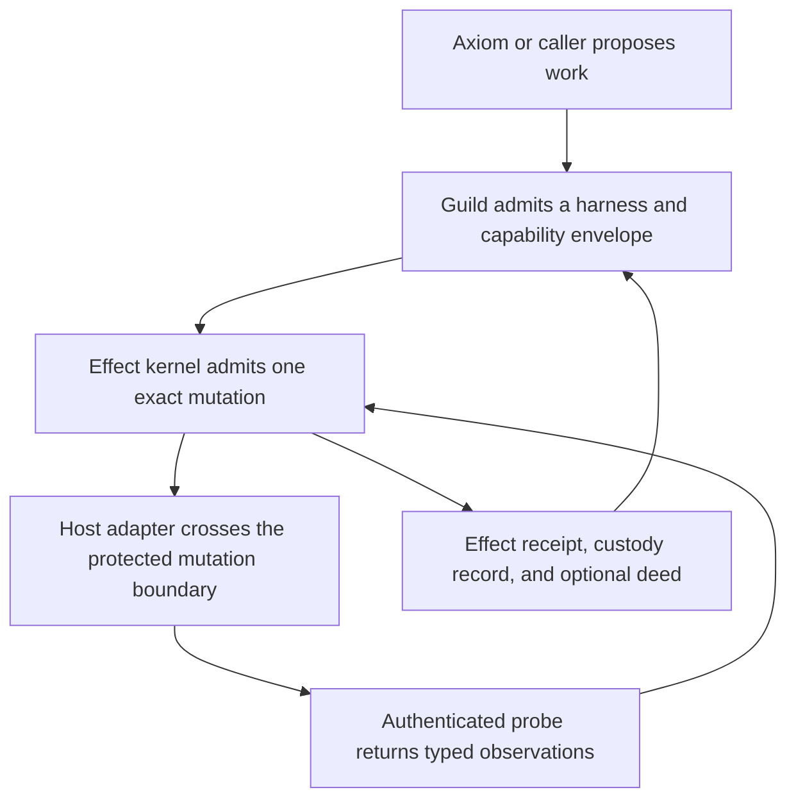

# Guild Effect Kernel Migration Design

**Status:** Proposed; pending written-spec review

**Date:** 2026-09-02

**Owner:** Joseph Kordish

**Source design:** `jkordish/jidoka` commit
`78ace548bdfbf7bd354c0d97e22f71b3dfd6526f`, file
`docs/superpowers/specs/2026-09-01-jidoka-autonomous-change-kernel-recovered-design.md`

**Source file SHA-256:**
`86df64803cd2da89f6d6499aac4f884184b2799122a8f2e5e4cc7f9f178b177b`

## 1. Decision

Guild will absorb the recovered Jidoka autonomous change kernel as a pure Rust
crate named `guild-effect-kernel`.

Guild remains the product, execution substrate, session boundary, and host of
durable operator-facing records. The effect kernel becomes Guild's one
authoritative implementation of exact mutation admission, single-use start,
postcondition and causality classification, effect receipts, and custody.

This is not a wholesale import of the Jidoka repository. The historical
workstation control plane duplicates responsibilities now owned by Guild and
Axiom. Its macOS desired-state material may inform a future workstation
adapter, but its CLI, planner, provider framework, policy engine, and run-state
model do not enter the trusted kernel.

The crate is deliberately not named `guild-kernel`. That name would imply it
owns all Guild trust semantics and would invite unrelated runtime, session,
registry, and transport responsibilities into the same trusted computing base.
`guild-effect-kernel` names the exact boundary.

## 2. Why The Repository Boundary Changes

The current Guild repository already owns:

- executable and artifact resolution;
- host-mediated capability admission;
- isolated skill and future harness execution;
- execution-attempt identity and receipts;
- durable evidence records;
- future durable session brokering and receipt aggregation;
- Axiom's pre-admission plan-review surface.

The recovered Jidoka design owns a narrower missing boundary:

- exact effect warrants and approvals;
- permanent effect idempotency bindings;
- resource leases and monotonic fences;
- a one-shot start permit after durable compare-and-swap;
- authoritative typed observations;
- independent postcondition and causality classification;
- exactly one terminal receipt for every started effect;
- deed-backed custody and conservative recovery.

Keeping both as independent products would create two admission stories, two
evidence stories, and two receipt stories. Moving the effect protocol into the
Guild workspace makes ownership explicit while retaining a hard crate boundary
that allows non-Guild consumers to use the kernel.

Repository separation is not the tool-agnostic guarantee. Dependency direction,
pure APIs, protocol vectors, and conformance tests are the guarantee.

## 3. Goals

1. Give Guild one deterministic mutation truth boundary without weakening its
   existing execution and session contracts.
2. Preserve the recovered protocol's safety laws and canonical identities
   before changing or generalizing them.
3. Keep the effect kernel usable by a workstation adapter, Terraform runner,
   CI job, Kubernetes controller, cloud adapter, or human procedure without
   requiring Guild's runner, registry, MCP server, or session substrate.
4. Make the distinction between planning truth, execution truth, and external
   effect truth mechanically visible.
5. Prevent a session resume, execution retry, or AI retry from repeating a
   protected mutation after durable start.
6. Use static artifact publication and separation as the first proof rather
   than widening the protocol to fit a more fashionable demo.
7. Preserve the original Jidoka repository and recovered source commit as
   historical provenance until migration parity is verified.

## 4. Non-Goals

- No `apply` runtime is enabled by this migration design.
- No public CLI command, MCP tool, WIT world, manifest field, capability
  family, session manager, or provider plugin ABI is added by the first crate.
- Axiom Plan IR does not gain execution, approval, warrant, receipt, or
  evidence authority.
- Guild's current `ExecutionReceipt` is not replaced or generalized.
- Guild's current `EvidenceRef` is not redefined as authoritative effect
  evidence.
- The kernel does not authenticate principals, read a clock, persist bytes,
  execute commands, invoke providers, or probe external state.
- The historical Jidoka v2 Ansible files and unimplemented Rust control-plane
  design are not imported wholesale.
- The first protocol does not become a generic effect plugin system.
- The migration does not claim distributed transactions, distributed
  consensus, automatic rollback, or exactly-once external execution where the
  provider cannot enforce it.

## 5. Three Truth Layers

Guild must keep three truth layers separate.

| Layer | Authoritative for | Not authoritative for |
| --- | --- | --- |
| Axiom Plan IR | Planner intent, requested composition, requested grants, expected outputs, and expected evidence | Resolution, admission, approval, execution, receipts, or external state |
| Guild execution/session host | Resolved executable identity, capability decision, harness materialization, execution-attempt outcome, evidence-record persistence, and session lineage | Whether an external mutation achieved its exact postcondition or caused the observed incarnation |
| Guild effect kernel | Exact mutation authority, start eligibility, effect identity, typed observation classification, terminal effect outcome, and custody | Which tool, skill, harness, or session should be chosen or how external I/O is performed |

If the layers disagree, the authority closest to its own subject wins. An Axiom
expectation cannot override a Guild policy decision. A successful Guild
execution cannot override a `Failed` or `Indeterminate` effect receipt. A
session summary cannot upgrade either attempt-local or effect-local truth.

## 6. Architecture



The kernel accepts values and returns values. A Guild-owned coordinator supplies
authenticated principals, explicit time, current anchored history, canonical
probe observations, and proposed transition commands. The coordinator commits
transition bundles through an outer store and releases an adapter start permit
only after the start bundle is durably committed.

The first implementation stops at the pure kernel boundary. Store, coordinator,
adapter, CLI, runner, and session integration require later bounded designs and
must not be scaffolded speculatively inside the kernel crate.

## 7. Crate Boundary And Dependency Firewall

The target package and crate names are:

- Cargo package: `guild-effect-kernel`
- Rust crate: `guild_effect_kernel`
- workspace location: `crates/guild-effect-kernel`

The dependency direction is one-way:

```text
Guild host components  --->  guild-effect-kernel
                               |
                               +---> protocol-focused third-party crates only

guild-effect-kernel  -X->  guild-types
guild-effect-kernel  -X->  guild-runner
guild-effect-kernel  -X->  guild-registry
guild-effect-kernel  -X->  guild-mcp
guild-effect-kernel  -X->  Wasmtime, Tokio, filesystem, network, process, clock,
                            database, provider SDK, UUID, or AI dependencies
```

The kernel may use deterministic in-memory data structures and ordinary Rust
`std` types. It is not required to be `no_std`. It must perform no I/O and must
not obtain ambient time, randomness, locale, environment, filesystem ordering,
or model output.

Protocol-sensitive dependencies remain exact package-local pins. The crate
must compile under Guild's workspace toolchain, currently Rust `1.94.0`. The
recovered Jidoka document's Rust `1.98.0` pin is an implementation-environment
delta, not a protocol law. Guild's toolchain must not be upgraded merely to
avoid checking whether the kernel actually needs a newer compiler.

An `xtask` dependency-boundary check will inspect Cargo metadata and fail if
the crate acquires a forbidden Guild, runtime, I/O, or provider dependency.
Protocol conformance remains the deciding test if a dependency version differs
from the recovered document.

## 8. Protocol Identity And Provenance

The migrated implementation is the Guild effect kernel implementing Jidoka
effect protocol v1. Moving repositories and renaming the crate must not
silently rewrite canonical protocol bytes.

For v1:

- `schemaVersion: "jidoka.dev/events/v1"` remains unchanged;
- the 29 body kinds remain unchanged;
- the 26 event types remain unchanged;
- the canonical body golden bytes and digest remain unchanged;
- warrant, approval, lease, fence, evidence, receipt, deed, custody, and
  recovery laws remain unchanged.

The Jidoka name therefore survives only as the v1 wire-protocol family and
historical provenance. It is not a second product or runtime. Any future wire
rename requires a new protocol version and explicit migration rules; it may
not mutate v1 identities in place.

The recovered source specification will move to
`docs/protocol/effect-kernel-v1.md` with a provenance block containing the
source repository, commit, path, and SHA-256 listed at the top of this design.
The source document is copied, not paraphrased, before Guild-specific deltas
are applied as an explicit change ledger.

## 9. Authority Composition

Guild execution admission and effect admission are cumulative, not competing.

1. Guild resolves the exact executable or harness identity.
2. Guild evaluates caller-requested capability grants and selects the effective
   runtime envelope.
3. The host obtains fresh authenticated observations needed to construct an
   exact effect input and precondition.
4. A proposer creates a content-addressed effect warrant.
5. An enrolled, policy-valid approver approves that exact warrant digest.
6. The kernel reserves budgets and resources, permanently binds the effect
   idempotency key, and issues a five-second lease and monotonic fences.
7. Immediately before mutation, fresh observations and current policy facts
   are checked again.
8. The outer store durably commits `Started` through compare-and-swap.
9. Only then may the coordinator release the sealed one-shot start permit to
   the adapter.

Both admission layers are required. A Guild capability grant defines the
maximum authority available to the harness. A kernel approval authorizes one
exact use of that authority against exact resources and preconditions.

Current Guild `PolicyDecision` values and manifest fields such as
`apply_requires_approval` are not effect approvals. They may require the
effect-approval workflow, but only a valid kernel approval body names and
authorizes an exact warrant.

The outer Guild host authenticates proposer, approver, revoker, witness, clock,
and store identities before submitting their values to the kernel. The kernel
validates enrollment and transition laws but does not perform authentication.

## 10. Identity And Idempotency

Guild currently has caller request, execution, trace, skill, and future session
identities. The effect kernel adds effect, resource, installation, warrant,
binding, receipt, deed, and custody identities. None may be substituted for
another merely because their string encodings look convenient.

In particular:

- `CallerRequest.idempotency_key` remains execution-request input and is not a
  permanent effect binding;
- a kernel `IdempotencyKey` becomes permanent only through the admitted
  `idempotency-binding/v1` body and reservation event;
- `SessionId` cannot be used as an effect idempotency key;
- retrying a Guild invocation does not mint a new effect key automatically;
- a new warrant, nonce, approval, idempotency key, and effect identity are
  required for a genuinely new mutation attempt;
- after a pre-start cancellation, the original warrant and binding remain
  spent even though no effect receipt exists.

Any future convenience mapping from a caller request key to an effect key must
be explicit, deterministic, collision-resistant, and reviewed as a separate
contract. V1 performs no implicit mapping.

## 11. Receipt Model

Guild will have three distinct durable receipt levels when the session layer is
eventually implemented:

| Receipt | Subject | Canonical answer |
| --- | --- | --- |
| `ExecutionReceipt` and `ExecutionRecord` | One host execution attempt | What was resolved, admitted, run, blocked, emitted, and how the attempt terminated |
| Effect receipt | One started protected mutation | Whether authoritative evidence proves `Verified`, `Failed`, or `Indeterminate`, and why |
| Future session receipt | Ordered session lineage | Which execution attempts belong to the durable session and how it materialized over time |

The effect receipt is not a replacement for `ExecutionReceipt`, and Guild must
not create a generic envelope that blurs them.

An execution can terminate successfully while its effect is `Failed` or
`Indeterminate`. An execution can fail after a durable effect start while the
effect remains unresolved until recovery. A recovery execution can fail or
succeed independently of the original execution while terminalizing the
original `EffectId` without repeating its mutation.

The eventual `ExecutionRecord` integration stores ordered links to effect
protocol identities and terminal receipt digests. It does not copy effect
classification fields as a second authoritative source. Human and machine
presentation may derive a combined view, but it must display execution and
effect outcomes separately. Any user-facing apply command exits nonzero for a
`Failed`, `Indeterminate`, or unresolved started effect even when the adapter
process itself returned success.

## 12. Evidence Model

Guild evidence and effect evidence have different semantics:

- a Guild `EvidenceRef` identifies one host-persisted emission and its metadata;
- a kernel observation body is a closed, canonical, authenticated statement
  required by an effect schema;
- a provider command report is only evidence about what the command reported;
- postcondition and causality are independently derived by the kernel;
- only exact evidence with no limitations may mint a deed.

Guild may store canonical kernel bodies in its content-addressed object
facilities and may expose operator-friendly references to them. Storage reuse
does not transfer authority: an arbitrary `EvidenceRef` cannot satisfy a kernel
observation field, and an evidence blob's existence does not authenticate its
witness.

Axiom `expectedEvidence` remains an expectation. It cannot create, predict, or
substitute for Guild evidence records or kernel observation bodies.

## 13. Persistence Boundary

The pure kernel proposes `TransitionBundle` values. A Guild-owned outer store
must provide, per enrolled kernel installation:

- immutable canonical bodies keyed by recomputed body digest;
- immutable canonical events keyed by recomputed event digest;
- one authenticated current head anchor;
- atomic compare-and-swap from `expectedHead` to `newHead` while publishing all
  new bodies and events as one durability unit;
- a trusted commit outcome or a read-after-unknown recovery path;
- byte preservation sufficient to reproduce all golden identities.

The current Guild object store and execution-record persistence do not by
themselves prove this contract. `guild-registry` may implement the outer store
later, but only after focused atomicity, crash, corruption, rollback, and
concurrency tests demonstrate the required behavior.

No public `guild://` effect URI family is frozen in the first crate milestone.
The first implementation exposes canonical digests and in-memory model APIs.
A public URI surface is added only when a real durable Guild store owns those
resources and `guild get` can read them honestly.

Projection caches and dossier summaries are derived. If they disagree with a
full replay from the authenticated head, replay wins and the cache is discarded.

## 14. Retry, Resume, And Recovery

The durable effect start event is a cross-layer retry barrier.

- Before reservation, Guild may retry ordinary planning and inspection.
- After reservation but before start, the same request may inspect existing
  state or cancel according to the closed protocol; it may not silently create
  another binding.
- After durable `Started`, no execution retry, session resume, rehydration,
  cold start, agent retry, timeout handler, or operator retry may reissue the
  protected mutation.
- After `Started`, recovery replays the anchored chain, obtains fresh
  authoritative observations, and terminalizes the existing effect.
- If causality cannot be proven, recovery produces `Indeterminate`; it does not
  perform the mutation again to make the dashboard prettier.
- `Indeterminate` custody blocks automatic mutation of the disputed resource
  until a future explicit dispute-resolution protocol exists.

Guild's current `ExecutionError.retryable` field is not sufficient authority
to cross an effect start barrier. Host retry policy must consult effect state
before acting. A generic retryable transport error after start becomes a
recovery trigger, not permission to rerun.

Session lifecycle remains orthogonal. A session may resume or rehydrate the
harness, but the effect's immutable lineage and start barrier survive every
materialization mode.

## 15. Relationship To Axiom Plan IR

Axiom remains a pre-admission planner above Guild.

The first effect-kernel migration makes no Axiom schema change. Axiom nodes may
continue to request skills, arguments, grants, outputs, and expected evidence.
They may not carry approved warrants, granted effect authority, effect receipts,
deeds, custody state, or claims that a mutation occurred.

A future Axiom extension may describe proposed effect intent for review, but
the value must remain advisory until Guild resolves executable identity,
obtains fresh external observations, constructs a canonical effect input and
precondition, and completes both Guild and kernel admission.

The governing flow is:

```text
Axiom plan -> validation and preview -> Guild resolution and capability admission
           -> exact effect warrant and approval -> kernel start permit
           -> adapter mutation -> probe -> kernel effect receipt
           -> Guild execution/session linkage
```

## 16. First Effect And Workstation Proving Ground

The recovered protocol's first closed effect family remains static artifact
publication followed by separation into quarantine. The first adapter uses
local files on the new macOS workstation.

This supersedes `cache purge with evidence trail` as Guild's first mutation
proof. Cache purge remains a plausible later effect family, but it has weaker
custody semantics and no completed formal state machine. Broadening the first
kernel to accommodate it would discard the strongest existing design merely
to preserve an aspirational demo choice.

The local-file adapter is outside `guild-effect-kernel`. It must supply:

- injective canonical logical addresses;
- stable external incarnation identities;
- authenticated present and absent observations;
- a protected move/copy boundary;
- conditional mutation or an explicit `non_atomic_external_operation`
  limitation;
- authoritative source, target, active, and quarantine probes;
- durable outer-store and trusted-clock boundaries.

The historical Jidoka v2 desired-state model is not the first adapter
specification. A later workstation design may reuse its profile taxonomy and
human-gate inventory, but it must route protected mutations through the effect
kernel and use Guild/Axiom rather than reintroduce a parallel planner, CLI,
policy engine, receipt system, or run database.

## 17. Migration Mechanics

Migration proceeds without deleting or rewriting Jidoka history.

### Phase 0: Decision And Provenance

1. Land this design and ADR 0021 in Guild.
2. Record the source commit, path, and SHA-256.
3. Keep `jkordish/jidoka` and branch `jidoka-kernel-recovery` intact.

### Phase 1: Normative Protocol Import

1. Copy the recovered specification verbatim to
   `docs/protocol/effect-kernel-v1.md` with a provenance header.
2. Add a change ledger for Guild ownership, crate naming, workspace toolchain,
   and integration terminology.
3. Preserve v1 canonical protocol identifiers and golden bytes.
4. Update `SPECS.md`, `ARCHITECTURE.md`, `AGENTS.md`, and the ADR index to
   distinguish planned effect truth from currently shipped inspect behavior.
5. Update `docs/first-honest-mutation-demo.md` so static artifact publication
   is the first formal mutation proof and cache purge is later work.

### Phase 2: Pure Kernel

Implement the recovered thirteen-increment delivery order inside
`crates/guild-effect-kernel`, test-first, without Guild runtime wiring. Each
increment receives its own reviewed commit and remote checkpoint.

### Phase 3: Conformance Gate

Before host integration:

- reproduce every canonical golden byte sequence and digest;
- pass legal-history replay and illegal-history rejection properties;
- pass crash-point, counter-exhaustion, fencing, exactly-once receipt, and deed
  unforgeability tests;
- pass the dependency-boundary check;
- prove a clean workspace build under Guild's pinned toolchain.

### Phase 4: Host Integration Design

Write and approve a separate design for:

- authenticated effect-store ownership and atomic head compare-and-swap;
- trusted clock and principal mapping;
- Guild execution-record effect links;
- recovery scheduling and session retry barriers;
- the local-file adapter and its protected mutation boundary;
- operator and machine-readable inspection surfaces.

No adapter or active `apply` path is implemented before this design is
approved.

### Phase 5: Jidoka Repository Disposition

After the normative spec, kernel implementation, vectors, and provenance are
verified in Guild:

- add a clear migration pointer to the Jidoka README;
- preserve the repository and branches read-only or archive them;
- inventory workstation profiles for selective reuse in a new Guild adapter;
- do not import Ansible execution files or duplicate Rust control-plane plans
  as active Guild architecture.

## 18. Failure Modes And Required Responses

| Failure | Required response |
| --- | --- |
| Kernel imports Guild runtime or I/O dependencies | CI fails the dependency-boundary check. |
| Axiom plan claims approval or effect success | Validation fails; the claim remains non-authoritative. |
| Guild execution succeeds but effect receipt fails | Preserve both outcomes; user-facing apply fails. |
| Runner crashes after effect start | Recover by probe; never repeat the protected mutation. |
| Session resumes after effect start | Resume harness only; existing effect remains behind its start barrier. |
| `CallerRequest.idempotency_key` is reused as effect authority | Reject the implicit mapping; require an explicit effect key and binding. |
| Arbitrary Guild evidence is submitted as an observation | Kernel schema or witness validation rejects it. |
| Store commit outcome is unknown | Re-read the authenticated head; never issue or reissue a start permit. |
| Dossier is internally valid but stale | Refuse freshness until its head equals the independently authenticated store anchor. |
| Protocol namespace is edited during crate rename | Golden vectors fail; require a new protocol version. |
| Cache-purge demo pressures v1 into a generic plugin ABI | Defer cache purge; keep the first registry closed. |
| Old Jidoka control-plane code is imported wholesale | Stop the migration and inventory only reusable workstation intent. |

## 19. Verification Strategy

The design phase is verified by:

- documentation link and positioning checks;
- ADR index consistency;
- a placeholder and ambiguity scan;
- explicit comparison against Guild's current receipt, evidence, session,
  Axiom, and apply boundaries;
- clean Git status outside the intended documentation changes.

The implementation phase additionally requires the complete recovered kernel
test matrix. The first host integration requires model-based crash testing
across every boundary before and after durable start, including unknown store
outcomes, permit-delivery loss, probe failure, process death, session
rehydration, and duplicated operator requests.

No test may claim exactly-once external mutation solely because an in-memory
unit test ran once. The store and adapter boundaries must be tested separately
against their actual guarantees.

## 20. Acceptance Criteria

The migration is complete when:

1. Guild contains the provenance-preserving v1 protocol specification and the
   pure `guild-effect-kernel` crate.
2. The old Jidoka repository contains a migration pointer and no longer presents
   itself as a competing active control plane.
3. The kernel has no dependency on any Guild crate or effectful runtime library.
4. Canonical bodies, event identities, golden vectors, and replay results match
   the recovered v1 protocol.
5. Guild documentation names Axiom planning truth, Guild execution/session
   truth, and effect truth separately.
6. Guild execution receipts, effect receipts, and future session receipts are
   not collapsed into a generic envelope.
7. A durable effect start prevents all automatic mutation retries across
   execution and session boundaries.
8. Static artifact publication and separation pass the complete kernel model
   and conformance suite before any broader effect family is admitted.
9. No public CLI, MCP, URI, manifest, WIT, or `apply` claim exists without a
   corresponding behavior-backed host integration.
10. The local-file adapter and active apply path remain gated behind their own
    reviewed host-integration design.

## 21. Consequence

Guild becomes the single product surface without becoming one undifferentiated
blob. Axiom makes AI intent reviewable. Guild controls which isolated actor may
run. The effect kernel controls which exact external change may start and what
authoritative evidence proves afterward.

That division removes the duplicate Jidoka control plane while preserving the
part worth keeping: a small, replayable, deterministic law for consequential
change.
